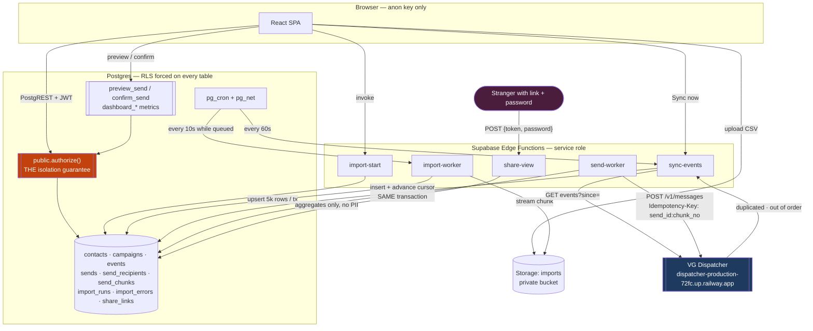

# Implementation Plan — Velocity Growth Client Campaign Portal

> **Executor note:** Phase 1 copies this file verbatim to `docs/IMPLEMENTATION_PLAN.md` and commits it.
> It is the contract. Do not make architectural decisions that are not in here — if something is
> genuinely undecided, it is listed in §10 *Open questions*, and you must stop and ask.

---

## Context

This is a take-home build for Velocity Growth. Three client brands (Kilele Rides / Kenya, Karoo
Coaches / South Africa, Marrakech Express / Morocco) share one product and one database. Six people
(one owner + one analyst per brand) log in, work only with their own brand's growth data, send
campaigns through a real messaging provider, and publish password-protected result links to clients
who have no login.

The graders will **actively attack it**: signing in as each of the six users directly against
PostgREST with the anon key, pressing confirm on a send from two sessions at once, replaying
duplicated and out-of-order delivery reports, re-uploading the same export, and coming at the share
link as a stranger. The brief grades "the data and the guarantees around it" above UI.

The work is executed by a less capable model, phase by phase, gated by automated metrics. Every
business rule is therefore written as a Given/When/Then acceptance criterion with a stable ID
*before* any code exists, and each criterion maps to at least one automated test naming that ID.

**Verified inputs.** The seed zip was re-downloaded and its SHA-256 is
`4961a25b151ca13ac56089ca46b94def6074c315445ec193c7bf87060683d35c`, matching the brief exactly, and
every file in `vg-growth-engineer-seed/` is byte-identical to its zip member. **Every anomaly
documented in §2 is therefore a deliberate fixture, not corruption.** Treat each one as a test the
graders already wrote.

**Repo.** `campaign-portal/` already exists with one commit (MIT licence, stub README) and no
remote configured. Build there.

---

## 1. The eleven done-rules, and where each is guaranteed

| # | Done-rule (abbreviated) | Guaranteed by | Proven by |
|---|---|---|---|
| 1 | Three brands live, six logins, each lands in its own portal, either sign-in method; owners send, analysts can't, outsiders get nowhere | `allowed_emails` + `before-user-created` auth hook; `memberships`; `public.authorize()` in every policy; owner-only checks in `confirm_send` | AC-AUTH-01..08 |
| 2 | A brand sees its own data and nothing from another brand, on every route, **including routes added later** | RLS **enabled and forced** on every table, default-deny, all policies delegating to the single helper `public.authorize()` | AC-ISO-01..07, incl. the catalog-driven test that auto-covers future tables |
| 3 | Data loads; the marketer sees what didn't; loading the same export twice leaves one set of customers | Chunked import worker; `import_runs` / `import_errors`; `UNIQUE(brand_id, external_id)` + `ON CONFLICT DO UPDATE` | AC-IMP-01..12 |
| 4 | The numbers are right; ambiguous counts state their rule on screen | All metrics computed in SQL (`brand_dashboard_*` functions); mandatory `<CountingNote>` component beside every ambiguous figure | AC-NUM-01..09 |
| 5 | As usable for the big brand as the small one (~90×) | Server-side pagination + keyset cursors; all aggregates in SQL; chunked import; no client-side counting | AC-SCALE-01..03 |
| 6 | Sending is safe and honest: confirmed count is what's approved; interrupted/retried never double-sends or half-sends silently; last month's approval still reads approved | Frozen `send_recipients` snapshot; `confirm_send` RPC with expected-count check under row lock; partial unique index (one active send per campaign); `send_chunks` with idempotency key persisted **before** the HTTP call | AC-SEND-01..12 |
| 7 | Provider talks back over time, including while the app isn't looking; contactability stays correct | `pg_cron` + `pg_net` → `sync-events` Edge Function every minute + manual "Sync now"; raw-event table with unique provider event id; cursor advanced in the **same transaction** as the insert; monotonic flags + precedence; propagation to `contacts` | AC-EVT-01..10 |
| 8 | If someone removes the thing keeping brands apart, the tests fail | Catalog-driven isolation test enumerating `pg_class` — fails if RLS is disabled/unforced on *any* public table, or if `authorize()` is loosened | AC-ISO-01, AC-ISO-02, plus the documented manual break-check |
| 9 | Share link safe to send to a stranger: one campaign, nothing else, nothing reachable by guessing or getting past the password | 256-bit token, SHA-256 lookup hash, bcrypt password via pgcrypto; Edge-Function-only access (token+password in POST body); identical error for wrong token and wrong password; rate limiting; revocation; **anon has no SELECT on `share_links`** | AC-SHARE-01..09 |
| 10 | Behaves when things go wrong: bad input rejected not stored; loading/empty/broken screens say so; name your AI tools | zod at every boundary + DB CHECK constraints; TanStack Query states wired to explicit UI components; README "AI tools used" section | AC-UX-01..07 |
| 11 | A real web app, not a prototype; works on a phone | Tailwind mobile-first, responsive tables → card lists, 44px touch targets; deployed to Vercel | AC-APP-01..04 |

---

## 2. Data findings

Profiled with scripts (`scripts/profile-seed.ts`, committed in Phase 1). Row counts:

| File | Rows | Delimiter | Encoding | Notes |
|---|---|---|---|---|
| `kilele-contacts.csv` | 83,993 | `,` | UTF-8 **+ BOM** | 81,215 distinct ids |
| `kilele-contacts-delta-2026-09-01.csv` | 4,180 | `,` | UTF-8 **+ BOM** | 2,500 overlap + 1,680 new |
| `kilele-campaigns.csv` | 46 | `,` | UTF-8 | 44 distinct ids |
| `kilele-events.csv` | 312,000 | `,` | UTF-8 | 303,588 distinct ids |
| `kilele-send-log.csv` | 9 | `,` | UTF-8 | 7 distinct batch keys |
| `karoo-contacts.csv` | 13,042 | `,` | **cp1252 — NOT UTF-8** | 12,540 distinct ids |
| `karoo-campaigns.csv` | 19 | `,` | UTF-8 | |
| `karoo-events.csv` | 74,000 | `,` | UTF-8 | 69,100 distinct ids |
| `marrakech-contacts.csv` | 957 | **`;`** | UTF-8 | French headers |
| `marrakech-campaigns.csv` | 6 | **`;`** | UTF-8 | decimal comma |
| `marrakech-events.csv` | 940 | **`;`** | UTF-8 | |

### 2.1 File-level traps

**F1 — Marrakech is semicolon-delimited with French headers.** Parsed with `,` it yields a single
column. Headers are `external_id;full_name;e_mail;mobile;pays;city;signup_at;status;consent_marketing;deleted_at;suppressed_until;brand_code;notes`
— note `e_mail` (not `email`), `mobile` (not `phone`), `pays` (not `country`).

**F2 — Marrakech uses a decimal comma inside a semicolon file.** `spend` = `221,09`, `173,47`,
`61,81`. Parsing as a float without locale handling yields `221` or throws.

**F3 — `karoo-contacts.csv` is cp1252, not UTF-8.** 35 non-ASCII bytes. Decoding as UTF-8 throws at
byte 76,980. Offenders: `Ann\x96Marie Botha` (0x96 = en-dash), `Se\xe1n O\x92Connor` (0xe1 = á,
0x92 = right single quote). → `Ann–Marie Botha`, `Seán O'Connor`.

**F4 — Kilele contacts files carry a UTF-8 BOM.** Read naively, the first header becomes
`external_id` and every `external_id` lookup fails.

**F5 — Karoo contacts use a completely different header convention.** Title Case With Spaces
(`Full Name`, `Email`, `External Id`, `Consent Marketing`, `Brand Code`) and **a different column
order** — `Status` precedes `City` in Karoo, the reverse of Kilele. A positional parser silently
swaps them.

### 2.2 Structural corruption

**S1 — Kilele has a full header row repeated at data row 39,998.** Every field equals its own
column name (`external_id='external_id'`, `city='city'`, …). This is why `country` shows a value
`'country'` and `notes` shows `'notes'`.

**S2 — 70 short rows in `kilele-contacts.csv` (9 of 13 fields).** e.g.
`CT-904924,Rachid Fassi,x128@vg-eval.test,0712000000,KE,Nairobi,2026-02-01,active,true` — then
nothing. `deleted_at`/`suppressed_until`/`brand_code`/`notes` are absent, not empty.

**S3 — 46 shifted rows in `karoo-contacts.csv`.** These rows are written in *Kilele's* 9-column
order against *Karoo's* header, so every value lands one column left:

```
Full Name = 'CT-972515'          ← actually the external_id
Email     = 'Nomsa Haddad'       ← actually the full name
External Id = 'z2424@vg-eval.test' ← actually the email
Country   = 'ZZ'   Status = 'City'   City = '2026-02-01'   Signup At = 'active'
```

These are the sole source of `Country='ZZ'` (46), `Status='City'` (46), `City='2026-02-01'` (46)
and `Signup At='active'` (34). **Do not attempt to auto-repair by shifting.** Reject each with
`reason_code='COLUMN_COUNT_MISMATCH'` — the header says 13 fields, the row has 9.

**S4 — 15 equivalent short rows in `marrakech-contacts.csv`** (`pays='ZZ'`, null `brand_code`).

### 2.3 Duplicate keys — and what the duplicates *mean*

| File | Dup ids | Byte-identical | **Conflicting** |
|---|---|---|---|
| `kilele-contacts.csv` | 2,778 | 2,410 | **368** |
| `karoo-contacts.csv` | 502 | 430 | **72** |
| `marrakech-contacts.csv` | 24 | ~12 | ~12 |
| `kilele-campaigns.csv` | 2 (`CMP-014`, `KIL-0044`) | both | 0 |

**Crucially, every conflicting contact pair differs only in email case and/or surrounding
whitespace:**

```
CT-007796  email='  JAMES.WANJIRU.KIL7488@VG-EVAL.TEST '   (leading + trailing space, upper)
CT-007796  email='james.wanjiru.kil7488@vg-eval.test'
CT-009227  email='DENNIS.MOKOENA.KAR9227@VG-EVAL.TEST'
CT-009227  email='dennis.mokoena.kar9227@vg-eval.test'
```

→ **Import rule:** normalise email (`btrim` then `lower`) *before* dedupe, and the conflicts vanish.
Store email as `citext`. Within one file, last row wins for a given `(brand_id, external_id)`.
This is why `UNIQUE(brand_id, external_id)` + `ON CONFLICT DO UPDATE` is correct and why re-import
is idempotent.

**Event duplicates are all byte-identical** — 8,310 in Kilele, 4,735 in Karoo, 0 conflicting. So a
plain `ON CONFLICT (brand_id, provider_event_id) DO NOTHING` is safe and lossless.

### 2.4 Cross-brand contamination — reject, never re-route

| Where | What | Count |
|---|---|---|
| `kilele-contacts.csv` | rows with `brand_code='KAROO'`, `country='ZA'`, SA cities, emails `leak.kar.NNN@` | **312** |
| `karoo-contacts.csv` | rows with `Brand Code='KILELE'`, `Country='KE'`, `City='Nairobi'`, emails `leak.kil.NN@` | **88** |
| `marrakech-contacts.csv` | rows whose `e_mail` is a Kilele address (`*.kilNNNNN@`) | **245** |
| `karoo-campaigns.csv` | `CMP-014` "Weekend Flash Sale", `parent_campaign_id='KIL-0007'` | 1 |
| `kilele-campaigns.csv` | the same `CMP-014`, twice | 2 |
| `kilele-contacts.csv` | `city` values `Bloemfontein`, `Durban`, `Johannesburg`, `Cape Town`, … | 312 |

**Rule:** if `brand_code` is present and does not match the brand being imported, reject the row
with `reason_code='BRAND_MISMATCH'` and report it. Never write it under either brand. The 245
Marrakech rows carrying Kilele-looking *emails* have `brand_code='MARRAKECH'` — accept those (the
email local-part is not authority) but surface a warning count. `CMP-014` under Karoo is rejected
(`BRAND_MISMATCH` via its `KIL-` parent); under Kilele it dedupes to one row.

### 2.5 Field-level messiness

**Email** (`kilele-contacts.csv`, 1,648 invalid + 1,810 null):

```
'john doe@vg-eval.test'      (space in local part)
'missing-at-sign.test'       (no @)
'bad@ vg-eval.test'          (space after @)
'no-tld@vg-eval'             (no TLD)
'double@@vg-eval.test'       (two @)
'  JAMES.WANJIRU.KIL7488@VG-EVAL.TEST '  (padded + uppercase — valid after normalising)
```

Domains seen: `vg-eval.test` (81,205), `' vg-eval.test'` (211), `vg-eval` (197),
`'vg-eval.test '` (179). → trim first, then validate; only then reject.

**Phone** — 4 legitimate shapes plus 2 broken, across all files:

```
0712345678          (national, leading zero, 10 digits)
254-712-345678      (hyphenated)
+254 712 345 678    (spaced E.164)
025712345678        (12 digits, leading 0 — trunk-prefixed)
7.77E+08            ← 44 rows: Excel destroyed these. UNRECOVERABLE.
'phone'             ← 1 row: the embedded header (S1)
```

Marrakech mobiles are `+212 6NNNNNNNN`. Normalise to E.164 per brand country; store both raw and
normalised; scientific-notation values → `reason_code='PHONE_UNRECOVERABLE'`, field warning, keep
the contact (phone is not the identity key).

**`country`** — 19 distinct values in Kilele for what should be ~6:

```
KE (55,209)  SS (4,600)  UG (4,593)  RW (4,593)  ET (4,592)  TZ (4,581)
254 (510)    KEN (489)   kenya (484)  Kenya (464)  'ke ' (452)
NULL (424)   null (419)  none (388)   '\N' (380)   '-' (380)   N/A (351)
ZA (312)     'country' (1)
```

Six spellings of "no value" (`NULL`, `null`, `none`, `\N`, `-`, `N/A`) plus empty. A naive
`NOT NULL` check passes all six. **Normalise the null-sentinel set to real NULL before validating.**
`254` is a dialling code, `KEN` is ISO-3, `kenya`/`Kenya`/`ke ` are case/whitespace variants — all
map to `KE`.

**`status`** — 9 variants: `active` (70,370), `unsubscribed` (6,557), `bounced` (3,162),
`pending` (1,726), `ACTIVE` (697), `'active '` (688), `Active` (661), `unsubscribe` (112, singular),
`'status'` (1). Trim + lowercase + map `unsubscribe`→`unsubscribed`. **`pending` is a real fourth
state** and is not contactable.

**`consent_marketing`** — 10 spellings across brands, roughly evenly distributed:
`true`/`TRUE`/`1`/`yes`/`Y` vs `false`/`FALSE`/`0`/`no`/`f`, plus 10,170 blanks in Kilele (12.1%)
and 12 in Karoo. **Blank is not false** — it is unknown, and unknown is *not* contactable (see
§6). Map to `boolean NULL`.

**`signup_at`** — three formats in one column:

```
2026-02-19T23:47:04Z    81,485   ISO-8601 UTC
2026-02-01               1,307   date only — no time, no timezone
20/02/2026 09:17         1,200   DD/MM/YYYY — AMBIGUOUS vs MM/DD
```

The DD/MM block is provably day-first: values like `20/02/2026`, `23/02/2026`, `28/02/2026` have a
first component > 12, and **all 1,200 fall in February**, so a MM/DD reading would be invalid.
Parse day-first, document the choice, and flag the parsing rule on screen.

**92 signups are dated in the future** (`2027-01` .. `2027-06-27`), max `2027-06-27T19:31:00Z`.
Reject with `reason_code='SIGNUP_IN_FUTURE'` — they would otherwise corrupt the signup chart and
inflate "total customers".

**`notes`** — 12 rows contain a **literal embedded newline** (`'VIP customer\nfollow up next quarter'`)
inside a quoted field; a line-splitting parser breaks here. One row is a **4,200-character** string
of `X` (length bomb). Cap at 1,000 chars with `reason_code='NOTES_TRUNCATED'` as a warning.

**`deleted_at`** — 417 Kilele rows soft-deleted. **`suppressed_until`** — 481 rows, all between
`2026-12-01` and `2027-05-16`, i.e. **every one is still in the future as of today**, so all 481
are currently suppressed. Karoo and Marrakech have both columns 100% null.

### 2.6 The delta file replaces, it does not patch

`kilele-contacts-delta-2026-09-01.csv`: 4,180 rows, all ids distinct, no BOM issues, **zero invalid
emails, zero cross-brand rows — it is clean**. 2,500 ids already exist in the main file; 1,680 are
new. All 2,500 overlapping rows are marked `notes='corrected in Sept export'`, and they replace
**every field**, not just corrections:

```
CT-000016 MAIN : Diana Mokoena  yassine.vermeulen.kil16@  Machakos  2026-02-10  consent=Y
CT-000016 DELTA: Fatima Odhiambo rose.cheruiyot.delta665@ Kisumu    2026-01-07  consent=false
```

Name, email, phone, city, signup date and consent all change. → **full-row upsert, delta applied
after main.** Import order matters and must be enforced by the UI (the delta is a separate upload;
warn if applied before the main file).

The 1,680 new rows are all `2026-08` signups — they are the **only** recent data in the entire
seed, and the only reason Kilele's 30-day chart is non-empty (§6).

### 2.7 Events

Event vocabulary **differs between the seed and the live provider** — this is a real integration trap:

| Seed (historical) | Provider (live, per docs) |
|---|---|
| `open`, `click`, `bounce`, `unsubscribe`, `complaint` | `delivered`, `bounced`, `opened`, `unsubscribed` |

Seed uses **bare verbs**, provider uses **past participles**. The seed has **`click` and
`complaint`, which the provider never sends**; the provider has **`delivered`, which the seed never
contains**. Normalise both into one canonical enum
(`delivered | opened | clicked | bounced | unsubscribed | complained`) at the boundary.

Consequence for metrics: **no historical campaign has a single `delivered` event.** A "delivery
rate" for historical campaigns can only come from `reported_delivered`. See §6.

Counts — Kilele: `open` 92,900, `click` 74,804, `complaint` 70,477, `bounce` 70,407,
`unsubscribe` 3,412. Karoo is near-uniform (~14.7k each). Event windows are narrow:
Kilele/Karoo/Marrakech all `2026-03-01` → `2026-04-05`.

**Files are already out of order** by both `event_id` and `occurred_at` — the shuffling starts in
the seed, before the provider is involved.

**Orphans:** Kilele and Karoo events resolve 100% against contacts and campaigns. **Marrakech has
633 of 940 events referencing campaigns `MAR-0007` .. `MAR-0018`, which do not exist** — the
campaigns file only has `MAR-0001`..`MAR-0006`. → quarantine with
`reason_code='UNKNOWN_CAMPAIGN'`, show the count in the UI, **do not auto-create stub campaigns**.

**Campaigns with no events:** `CMP-014`, `KIL-0033`, `KIL-0034`, `KIL-0035` (Kilele); `CMP-014`
(Karoo). These must render as a legitimate zero, not a spinner or a crash.

**3,330 Kilele contacts have an `unsubscribe` event plus later activity** (8,322 in Karoo). This is
exactly why status must be derived by **precedence, not arrival order** — an `open` arriving after
an `unsubscribe` must not resurrect contactability.

### 2.8 Reported campaign totals are internally inconsistent

`reported_*` columns cannot be trusted as ground truth:

```
KIL-0016  sent=10,640  delivered=10,108  opens=12,679   ← opens > delivered
KIL-0028  sent= 9,794  delivered= 9,304  bounced=489    ← delivered+bounced = 9,793 ≠ 9,794
KIL-0022, KIL-0040, +2 more: same two defects
```

6 of 46 Kilele campaigns have `opens > delivered`; 4 of 46 have `delivered + bounced ≠ sent`.
Karoo (0/19) and Marrakech (0/6) are self-consistent. → surface **both** a provider-reported figure
and an engagement-log-computed figure, clearly labelled (§6). This is the single best answer to
done-rule 4.

### 2.9 Brand timezones (derived, then verified)

`send_local_time` minus `sent_at_utc` gives each brand's offset, confirmed across all rows:

| Brand | Offset | IANA zone |
|---|---|---|
| Kilele Rides | UTC+3 | `Africa/Nairobi` |
| Karoo Coaches | UTC+2 | `Africa/Johannesburg` |
| Marrakech Express | UTC+1 | `Africa/Casablanca` |

Store on `brands.timezone` and use it for every date-bucketed metric.

### 2.10 Import validation rules implied

Executor: implement exactly this list in `packages/domain/src/import/`.

| # | Rule | Action | `reason_code` |
|---|---|---|---|
| 1 | Detect BOM; strip before header parse | fix | — |
| 2 | Detect delimiter (`,` vs `;`) by header sniff | fix | — |
| 3 | Decode UTF-8; on failure fall back to cp1252 | fix, warn | `ENCODING_FALLBACK` |
| 4 | Map headers via per-brand alias table (`e_mail`→email, `mobile`→phone, `pays`→country, `Full Name`→full_name, …) | fix | — |
| 5 | Row field count ≠ header count | **reject row** | `COLUMN_COUNT_MISMATCH` |
| 6 | Row whose values equal the header names | **reject row** | `EMBEDDED_HEADER_ROW` |
| 7 | Null sentinels (`NULL`,`null`,`none`,`\N`,`-`,`N/A`,`''`) → SQL NULL | fix | — |
| 8 | `external_id` missing or not `^CT-\d+$` / `^(KIL|KAR|MAR|CMP)-\d+$` | **reject row** | `BAD_EXTERNAL_ID` |
| 9 | `brand_code` present and ≠ target brand | **reject row** | `BRAND_MISMATCH` |
| 10 | email: trim → lower → RFC-lite validate | reject **field**, keep row | `INVALID_EMAIL` |
| 11 | email null/blank | keep row, mark not contactable | `MISSING_EMAIL` (warn) |
| 12 | phone: strip separators, normalise to E.164 by brand country | fix | — |
| 13 | phone matches `^\d\.\d+E\+\d+$` | clear field, warn | `PHONE_UNRECOVERABLE` |
| 14 | country: trim/upper; map `KEN`→`KE`, `kenya`→`KE`, `254`→`KE` | fix | — |
| 15 | country still not ISO-3166-alpha-2 | clear field, warn | `UNKNOWN_COUNTRY` |
| 16 | status: trim/lower; `unsubscribe`→`unsubscribed`; must be in enum | reject **field** | `UNKNOWN_STATUS` |
| 17 | consent: 10-spelling map → `true`/`false`; blank → `NULL` | fix | — |
| 18 | `signup_at`: try ISO-8601 → date-only → **DD/MM/YYYY day-first** | reject row if none parse | `UNPARSEABLE_DATE` |
| 19 | `signup_at` > `now()` | **reject row** | `SIGNUP_IN_FUTURE` |
| 20 | `notes` > 1,000 chars | truncate, warn | `NOTES_TRUNCATED` |
| 21 | spend with decimal comma (`221,09`) | fix | — |
| 22 | duplicate `(brand_id, external_id)` within one file | last wins, warn | `DUPLICATE_IN_FILE` |
| 23 | event → unknown campaign | quarantine | `UNKNOWN_CAMPAIGN` |
| 24 | event → unknown contact | quarantine | `UNKNOWN_CONTACT` |
| 25 | row where every field is empty (a genuinely blank line, not a short/shifted row) | **skip silently, count, do not write an `import_errors` row** | — (counted in `import_runs`, not itemised) |

> **Addendum (Phase 1, `scripts/profile-seed.ts`).** The counts above were cross-checked with an
> independent TypeScript re-implementation of the profiler, run against `seed/` after verifying its
> SHA-256 against the seed zip. Every headline number matched exactly (83,993 Kilele contacts,
> 81,215 distinct ids, 1,810 null / 1,648 invalid emails, 2,778 duplicate ids with 368 genuinely
> conflicting, 312 cross-brand rows, 92 future signups, 44 unrecoverable phones, …), **with one
> addition**: `kilele-contacts.csv` (7), `karoo-contacts.csv` (8) and `marrakech-contacts.csv` (3)
> each contain mid-file blank lines — rows where every field is empty. Python's `csv.DictReader`
> skips these silently, which is why the first pass didn't surface them as a distinct finding; they
> were folded invisibly into "rows" rather than counted. They are harmless to import (rule 25) but
> are a real data-quality fact worth naming, since they mean row *numbers* in `import_errors` must
> be counted from the raw file (including blank lines) to match what a marketer sees if they open
> the CSV themselves, not from a post-filter row index. See `docs/DATA_FINDINGS.md` (regenerate with
> `npm run profile`) for the live numbers, including the exact row numbers of every blank line.

---

## 3. Provider findings, contradictions, and the probe plan

Fetched `GET /v1/docs` (service `VG Messaging Dispatcher`, version **1.4.0**) and `/openapi.json`.

### 3.1 What the docs say

- **Auth:** `Authorization: Bearer <API_KEY>`, or `X-API-Key: <API_KEY>`. Key lives only in
  `PROVIDER_API_KEY` (§9). Never committed.
- **Rate limit:** 600 req/min per key.
- `POST /v1/messages` — headers: `Idempotency-Key` *(described as "Optional")*. Body:
  `{campaign?, brand?, recipients[]}`. Recipients "may be a string id or an object; we key on
  `id` / `external_id` / `contact_id` / `recipient_id` / `email`". Limit 100,000 per call.
  Returns `{batch_id, accepted[], rejected[]}` — `rejected` described as *"(normally empty)"*.
- `GET /v1/messages/{batch_id}/events` — query `since` = "the `event_id` of the last event you have
  already processed". Page size up to 1,000. Returns `{events[], next_cursor, has_more}`.
- `GET /healthz` — liveness, no auth.
- `event_types`: `delivered`, `bounced`, `opened`, `unsubscribed`.
- The OpenAPI spec also exposes `/admin/keys` (GET/POST, `x-admin-token`). **Out of scope — do not
  call it.** Note its existence in the README and move on.

### 3.2 Contradictions — design for the brief, not the docs

| # | Docs claim | Brief says | Design decision |
|---|---|---|---|
| C1 | *"every event is delivered exactly once and in order"* | *"deliberately messy and out of order in places"* | **Assume duplicated and out-of-order.** Unique `provider_event_id`, `ON CONFLICT DO NOTHING`, monotonic flags, precedence-based status. The seed files are already shuffled (§2.7) — the docs are wrong before the provider even runs. |
| C2 | Both `since=<event_id>` **and** `next_cursor` are documented, with no statement of how they relate | — | Probe P3. Persist **both** `sends.events_cursor` (opaque, from `next_cursor`) and `sends.last_event_id`. Prefer `next_cursor` when non-null; fall back to `since=last_event_id`. Advance **in the same transaction as the event insert** so a crash never skips events. |
| C3 | Recipients keyed on any of 5 fields | — | Send an **explicit object per recipient** with `{external_id, email, contact_id}` all populated, so whichever field the provider picks resolves to a row we can find. Store our `send_recipient.id` too. On ingest, try each key in order; unresolvable → quarantine, never guess. |
| C4 | `rejected` is *"normally empty"* | — | **Never assume empty.** Parse it, persist each entry to `send_recipients.status='rejected'` with the reason, surface the count in the send detail UI. "Normally" is where half-sends hide. |
| C5 | `Idempotency-Key` is *"Optional"* | "retried shouldn't send twice" | **Always send it**, `send_id:chunk_no`, persisted to `send_chunks` **before** the HTTP call. Optional for the provider ≠ optional for us. |
| C6 | Docs list 4 event types | Seed has 5 different ones (§2.7) | Canonical enum + boundary normalisation. Unknown type → quarantine, never drop. |

### 3.3 Probe script — `scripts/probe-provider.ts`

Run **before** Phase 7. Read-only first; the one write is a 2-recipient batch to synthetic
addresses. `npm run probe` → writes `docs/PROVIDER_PROBE.md`.

| # | Probe | Answers |
|---|---|---|
| P1 | `GET /healthz` (no auth) | Base URL reachable; response shape |
| P2 | `GET /v1/docs` with and without key | Whether auth is actually enforced |
| P3 | `POST /v1/messages` with 2 synthetic recipients → then `GET events` with **no** `since`, with `since=<first event_id>`, and with `next_cursor` | **C2**: are `since` and `next_cursor` the same space? Is `since` inclusive or exclusive? |
| P4 | Repeat P3's POST with the **same** `Idempotency-Key` | Same `batch_id` returned? Recipients charged twice? **C5** |
| P5 | Repeat with a **different** key, same body | Confirms the key (not the body) is what dedupes |
| P6 | POST with recipients as bare strings vs objects with each of the 5 key fields | **C3**: which field actually echoes back in events |
| P7 | POST with one deliberately malformed recipient (empty email) | **C4**: does `rejected` ever populate, and in what shape |
| P8 | Poll the same batch's events 3× over ~2 min, recording order and ids | **C1**: measure real duplication/reordering |
| P9 | `GET events` for a non-existent `batch_id`; calls with a bad key | Error shape + status codes to handle |

**Guard rails:** recipients only ever `probe-1@vg-eval.test` / `probe-2@vg-eval.test`; hard cap of 2
per call; the script refuses to run if `recipients.length > 2`. Every request/response is logged
verbatim to `docs/PROVIDER_PROBE.md` with the key **redacted**. Findings that contradict this plan
go to §10, not into silent code changes.

---

## 4. Architecture

### 4.1 Components

- **SPA** — Vite + React + TS, TanStack Query, Tailwind + shadcn/ui, zod. Vercel. **Anon key only.**
- **Postgres** — the authority. RLS forced everywhere; all metrics as SQL functions; state machine
  in constraints and RPCs, not in application code.
- **Edge Functions** (service-role, never reachable by the browser with elevated rights):
  `import-start`, `import-worker`, `send-worker`, `sync-events`, `share-view`.
- **pg_cron + pg_net** — `sync-events` every minute; `import-worker` every 10s while work is queued.
- **Supabase Storage** — private `imports` bucket, path `{brand_id}/{import_run_id}/{filename}`.

### 4.2 Data flow



### 4.3 Trust boundaries

| Boundary | Crossing | Control |
|---|---|---|
| **B1** Browser → Postgres | anon key + user JWT | RLS forced, default deny, every policy → `authorize()`. This is the boundary the graders attack directly. |
| **B2** Browser → Edge Function | user JWT forwarded | Every function re-verifies the JWT and re-checks membership **server-side**. Never trusts a `brand_id` in the request body — always derives it from the caller's membership. |
| **B3** Edge Function → Postgres | service-role key | Bypasses RLS by design. Therefore every function filters by a brand id it derived from the JWT, never from user input. Service key exists only in Supabase secrets. |
| **B4** App → Provider | `PROVIDER_API_KEY` | Server-side only. Never in the SPA bundle, never in a table the anon key can read. |
| **B5** Provider → App | polled, not pushed | All provider input is untrusted: unknown recipient → quarantine, unknown event type → quarantine, duplicate id → ignored. |
| **B6** Stranger → share-view | token + password in POST body | Anon has **no** SELECT on `share_links`. Token never in a URL query string or referer. Identical error for wrong token vs wrong password. Rate limited. Aggregates only. |

---

## 5. Schema

Migrations in `supabase/migrations/`. **The isolation guarantee lives in
`supabase/migrations/0003_rls_policies.sql`, in `public.authorize()` at the top of the file** —
this is the file:line cited in the submission note.

### 5.1 Extensions and enums — `0001_extensions.sql`

```sql
create extension if not exists pgcrypto;
create extension if not exists citext;
create extension if not exists pg_cron;
create extension if not exists pg_net;

create type public.brand_role      as enum ('owner','analyst');
create type public.contact_status  as enum ('active','pending','unsubscribed','bounced');
create type public.event_type      as enum ('delivered','opened','clicked','bounced','unsubscribed','complained');
create type public.event_source    as enum ('seed','provider');
create type public.send_status     as enum ('draft','approved','sending','sent','failed','cancelled');
create type public.chunk_state     as enum ('pending','in_flight','done','failed');
create type public.recipient_state as enum ('pending','sent','rejected','failed');
create type public.import_status   as enum ('queued','running','succeeded','partial','failed');
create type public.import_kind     as enum ('contacts','campaigns');
create type public.severity        as enum ('error','warning');
```

### 5.2 Tenancy — `0002_core_tables.sql`

```sql
create table public.brands (
  id uuid primary key default gen_random_uuid(),
  slug text not null unique check (slug ~ '^[a-z][a-z0-9-]{1,30}$'),
  name text not null,
  country char(2) not null,
  timezone text not null,            -- Africa/Nairobi | Africa/Johannesburg | Africa/Casablanca
  brand_code text not null unique,   -- KILELE | KAROO | MARRAKECH
  created_at timestamptz not null default now()
);

create table public.memberships (
  user_id uuid not null references auth.users(id) on delete cascade,
  brand_id uuid not null references public.brands(id) on delete cascade,
  role public.brand_role not null,
  created_at timestamptz not null default now(),
  primary key (user_id, brand_id)
);
create index on public.memberships (user_id);

-- Auth allowlist. NO policies at all => unreachable by anon and authenticated.
create table public.allowed_emails (
  email citext primary key,
  brand_id uuid not null references public.brands(id),
  role public.brand_role not null,
  created_at timestamptz not null default now()
);
```

### 5.3 The isolation guarantee — `0003_rls_policies.sql`

```sql
-- ============================================================================
-- THE data-isolation guarantee. Every RLS policy in this database delegates
-- here. Change this function and you change tenancy for every table at once.
-- SECURITY DEFINER so it can read memberships without recursing through
-- memberships' own RLS. search_path pinned to '' to defeat search_path attacks.
-- ============================================================================
create or replace function public.authorize(
  p_brand_id uuid,
  p_min_role public.brand_role default 'analyst'
) returns boolean
language sql stable security definer set search_path = ''
as $$
  select exists (
    select 1
    from public.memberships m
    where m.user_id  = (select auth.uid())
      and m.brand_id = p_brand_id
      and (p_min_role = 'analyst' or m.role = 'owner')
  );
$$;
revoke all on function public.authorize(uuid, public.brand_role) from public;
grant execute on function public.authorize(uuid, public.brand_role) to authenticated;
```

Applied to **every** tenant table by this exact pattern:

```sql
alter table public.<T> enable row level security;
alter table public.<T> force  row level security;          -- applies to table owner too

create policy <T>_select on public.<T> for select to authenticated
  using (public.authorize(brand_id));
create policy <T>_insert on public.<T> for insert to authenticated
  with check (public.authorize(brand_id, 'owner'));
create policy <T>_update on public.<T> for update to authenticated
  using (public.authorize(brand_id, 'owner')) with check (public.authorize(brand_id, 'owner'));
-- no delete policy => deletes denied by default
```

`brands`: select where `authorize(id)`. `memberships`: select where `user_id = auth.uid()`;
**no insert/update/delete policy of any kind** — users can never grant themselves a brand.
`allowed_emails`, `share_links`, `share_link_attempts`, `provider_events_raw`: **no policies**
(service-role only). Revoke `all on schema public from anon` except the RPCs listed in §5.9.

### 5.4 Tenant data — `0004_data_tables.sql`

```sql
create table public.contacts (
  id uuid primary key default gen_random_uuid(),
  brand_id uuid not null references public.brands(id) on delete cascade,
  external_id text not null check (external_id ~ '^CT-\d+$'),
  full_name text,
  email citext,                                   -- normalised: btrim -> lower
  email_valid boolean not null default false,
  phone_raw text,
  phone_e164 text,
  country char(2),
  city text,
  signup_at timestamptz,
  status public.contact_status not null default 'active',
  consent_marketing boolean,                      -- NULL = unknown, and unknown is NOT contactable
  deleted_at timestamptz,
  suppressed_until timestamptz,
  notes text check (notes is null or length(notes) <= 1000),
  source_import_run_id uuid,
  created_at timestamptz not null default now(),
  updated_at timestamptz not null default now(),
  constraint contacts_brand_external_uniq unique (brand_id, external_id),
  constraint contacts_signup_not_future check (signup_at is null or signup_at <= now() + interval '1 day')
);
create index contacts_brand_signup_idx  on public.contacts (brand_id, signup_at desc);
create index contacts_brand_status_idx  on public.contacts (brand_id, status);
create index contacts_brand_email_idx   on public.contacts (brand_id, email);
create index contacts_keyset_idx        on public.contacts (brand_id, created_at desc, id desc);
-- partial index backing the "contactable" metric
create index contacts_contactable_idx on public.contacts (brand_id)
  where deleted_at is null and consent_marketing is true
        and status in ('active','pending');

create table public.campaigns (
  id uuid primary key default gen_random_uuid(),
  brand_id uuid not null references public.brands(id) on delete cascade,
  external_id text not null,
  name text not null,
  channel text not null check (channel in ('email','sms')),
  target_country char(2),
  reported_sent int, reported_delivered int, reported_bounced int,
  reported_opens int, reported_clicks int,
  spend numeric(12,2),
  sent_at timestamptz,
  parent_external_id text,
  created_at timestamptz not null default now(),
  constraint campaigns_brand_external_uniq unique (brand_id, external_id)
);

create table public.engagement_events (
  id uuid primary key default gen_random_uuid(),
  brand_id uuid not null references public.brands(id) on delete cascade,
  contact_id uuid references public.contacts(id) on delete cascade,
  campaign_id uuid references public.campaigns(id) on delete cascade,
  send_id uuid references public.sends(id) on delete set null,
  provider_event_id text not null,
  event_type public.event_type not null,
  channel text,
  occurred_at timestamptz not null,
  source public.event_source not null,
  ingested_at timestamptz not null default now(),
  constraint events_brand_provider_uniq unique (brand_id, provider_event_id)  -- dedupe lives here
);
create index events_campaign_type_idx on public.engagement_events (campaign_id, event_type);
create index events_contact_idx       on public.engagement_events (contact_id);
create index events_brand_time_idx    on public.engagement_events (brand_id, occurred_at desc);
```

### 5.5 Import — `0005_import.sql`

```sql
create table public.import_runs (
  id uuid primary key default gen_random_uuid(),
  brand_id uuid not null references public.brands(id) on delete cascade,
  kind public.import_kind not null,
  filename text not null,
  storage_path text not null,
  file_sha256 text,                    -- identical re-upload is detectable and reported
  status public.import_status not null default 'queued',
  total_rows int, processed_rows int not null default 0,
  inserted_count int not null default 0, updated_count int not null default 0,
  rejected_count int not null default 0, warning_count int not null default 0,
  chunk_cursor int not null default 0,  -- resume point; survives a worker crash
  byte_offset bigint not null default 0,
  detected_encoding text, detected_delimiter text,
  error_summary text,
  created_by uuid not null references auth.users(id),
  created_at timestamptz not null default now(),
  started_at timestamptz, finished_at timestamptz
);
create index import_runs_brand_idx on public.import_runs (brand_id, created_at desc);

create table public.import_errors (
  id bigserial primary key,
  import_run_id uuid not null references public.import_runs(id) on delete cascade,
  brand_id uuid not null references public.brands(id) on delete cascade,
  row_number int not null,             -- 1-based, matches the file the marketer uploaded
  field text,                          -- null = whole-row rejection
  value_excerpt text check (length(value_excerpt) <= 200),
  reason_code text not null,           -- the §2.10 vocabulary
  reason text not null,                -- human sentence shown in the UI
  severity public.severity not null default 'error',
  created_at timestamptz not null default now()
);
create index import_errors_run_idx on public.import_errors (import_run_id, row_number);
```

### 5.6 Send state machine — `0006_sends.sql`

```sql
create table public.sends (
  id uuid primary key default gen_random_uuid(),
  brand_id uuid not null references public.brands(id) on delete cascade,
  campaign_id uuid not null references public.campaigns(id) on delete cascade,
  status public.send_status not null default 'draft',
  snapshot_count int not null,            -- frozen at preview; what the owner approves
  chunk_size int not null default 1000,
  chunks_total int not null,
  chunks_done int not null default 0,
  provider_batch_ids text[] not null default '{}',
  events_cursor text,                     -- opaque next_cursor
  last_event_id text,                     -- for since=<event_id>
  last_synced_at timestamptz,
  created_by uuid not null references auth.users(id),
  approved_by uuid references auth.users(id),
  approved_at timestamptz,
  created_at timestamptz not null default now(),
  constraint sends_approved_fields check (
    (status = 'draft' and approved_by is null and approved_at is null)
    or (status <> 'draft' and approved_by is not null and approved_at is not null)
  )
);

-- AT MOST ONE ACTIVE SEND PER CAMPAIGN. Double-confirm from two sessions loses here.
create unique index sends_one_active_per_campaign
  on public.sends (campaign_id)
  where status in ('draft','approved','sending');

-- The frozen recipient snapshot. Historical sends read THIS, never live contacts.
create table public.send_recipients (
  id uuid primary key default gen_random_uuid(),
  send_id uuid not null references public.sends(id) on delete cascade,
  brand_id uuid not null references public.brands(id) on delete cascade,
  contact_id uuid not null references public.contacts(id),
  external_id text not null,
  email citext,
  chunk_no int not null,
  state public.recipient_state not null default 'pending',
  provider_message_id text,
  rejected_reason text,
  -- monotonic flags: set-once true => any order, any duplication, same result
  has_delivered boolean not null default false,
  has_opened boolean not null default false,
  has_clicked boolean not null default false,
  has_bounced boolean not null default false,
  has_unsubscribed boolean not null default false,
  has_complained boolean not null default false,
  constraint send_recipients_uniq unique (send_id, contact_id)
);
create index send_recipients_chunk_idx on public.send_recipients (send_id, chunk_no);

create table public.send_chunks (
  send_id uuid not null references public.sends(id) on delete cascade,
  chunk_no int not null,
  idempotency_key text not null,     -- 'send_id:chunk_no' — WRITTEN BEFORE THE HTTP CALL
  state public.chunk_state not null default 'pending',
  attempts int not null default 0,
  provider_batch_id text,
  accepted_count int, rejected_count int,
  request_at timestamptz, response_at timestamptz,
  error text,
  primary key (send_id, chunk_no),
  constraint send_chunks_idem_uniq unique (idempotency_key)
);
```

**Derived message status** (`send_recipients` → display) by precedence, computed from flags so it
is order- and duplicate-independent:

```
bounced (5) > unsubscribed (4) > opened (3) > delivered (2) > sent (1) > pending (0)
has_opened   => has_delivered  (enforced in the ingest function: opened implies delivered)
has_bounced, has_unsubscribed  => sticky, never cleared
```

### 5.7 Provider ingest — `0007_events.sql`

```sql
create table public.provider_events_raw (
  id bigserial primary key,
  brand_id uuid not null references public.brands(id) on delete cascade,
  send_id uuid references public.sends(id) on delete cascade,
  provider_event_id text not null,
  payload jsonb not null,
  received_at timestamptz not null default now(),
  constraint provider_events_raw_uniq unique (provider_event_id)
);

create table public.event_quarantine (
  id bigserial primary key,
  brand_id uuid references public.brands(id) on delete cascade,
  send_id uuid references public.sends(id) on delete cascade,
  provider_event_id text,
  payload jsonb not null,
  reason_code text not null,        -- UNKNOWN_RECIPIENT | UNKNOWN_EVENT_TYPE | UNPARSEABLE
  reason text not null,
  received_at timestamptz not null default now()
);
```

`public.ingest_provider_events(p_send_id uuid, p_events jsonb, p_next_cursor text, p_last_event_id text)`
— SECURITY DEFINER, **one transaction**:
1. insert into `provider_events_raw` `ON CONFLICT (provider_event_id) DO NOTHING` → dedupe;
2. resolve the recipient by trying `external_id`, then `contact_id`, then `email` (C3); unresolved →
   `event_quarantine`, continue;
3. unknown event type → `event_quarantine`, continue;
4. insert `engagement_events` `ON CONFLICT DO NOTHING`;
5. `update send_recipients set has_x = has_x OR true` (monotonic; `opened` also sets `has_delivered`);
6. propagate: `has_bounced` → `contacts.status='bounced'`; `has_unsubscribed` →
   `contacts.status='unsubscribed', consent_marketing=false`. **Sticky — never reversed.**
7. `update sends set events_cursor, last_event_id, last_synced_at` — **same transaction**, so a
   crash rolls the cursor back with the events and nothing is skipped.

### 5.8 Share links — `0008_share.sql`

```sql
create table public.share_links (
  id uuid primary key default gen_random_uuid(),
  brand_id uuid not null references public.brands(id) on delete cascade,
  campaign_id uuid not null references public.campaigns(id) on delete cascade,
  token_sha256 bytea not null unique,     -- sha256 of a 32-byte (256-bit) random token
  password_hash text not null,            -- crypt(pw, gen_salt('bf', 12))
  created_by uuid not null references auth.users(id),
  created_at timestamptz not null default now(),
  expires_at timestamptz,
  revoked_at timestamptz,
  view_count int not null default 0,
  last_viewed_at timestamptz
);
-- NO RLS POLICIES AT ALL => anon and authenticated can never SELECT this table.
alter table public.share_links enable row level security;
alter table public.share_links force row level security;

create table public.share_link_attempts (
  id bigserial primary key,
  token_sha256 bytea,
  ip_hash text,
  ok boolean not null,
  attempted_at timestamptz not null default now()
);
create index share_attempts_window_idx on public.share_link_attempts (token_sha256, attempted_at desc);
create index share_attempts_ip_idx     on public.share_link_attempts (ip_hash, attempted_at desc);
```

Token: 32 bytes from `gen_random_bytes(32)` → base64url (256 bits, far above the 128-bit floor).
Returned to the owner **once**, at creation; only its SHA-256 is stored.

### 5.9 RPCs — `0009_rpc.sql`

All SECURITY DEFINER, `set search_path = ''`, and each **re-checks `authorize()` itself** — a
SECURITY DEFINER function bypasses RLS, so the check must be explicit.

```sql
-- Freeze the audience. Returns the count the owner is about to approve.
public.preview_send(p_campaign_id uuid) returns table (send_id uuid, recipient_count int)
  -- authorize(brand,'owner'); reuse an existing draft if one exists (idempotent preview);
  -- INSERT INTO send_recipients SELECT ... FROM contacts WHERE <contactable>  -- §6 rule
  -- chunk_no = (row_number() over (order by id) - 1) / chunk_size

-- Atomically approve. Two concurrent calls: exactly one returns true.
public.confirm_send(p_send_id uuid, p_expected_count int) returns public.sends
  -- 1. SELECT ... FOR UPDATE            (serialises concurrent confirms)
  -- 2. authorize(brand,'owner')         else raise insufficient_privilege
  -- 3. status = 'draft'                 else raise 'send_already_confirmed'
  -- 4. snapshot_count = p_expected_count else raise 'count_changed'  <- what the screen showed
  -- 5. UPDATE -> 'approved', approved_by = auth.uid(), approved_at = now()

public.revoke_share_link(p_id uuid)                  -- owner only
public.create_share_link(p_campaign_id uuid, p_password text) returns text  -- owner only; token returned ONCE
```

### 5.10 Metric functions and views — `0010_metrics.sql`

All `security_invoker = true`; **no materialized views over tenant data.**

```sql
create view public.v_contact_contactable with (security_invoker = true) as
  select c.*, (
    c.deleted_at is null
    and c.consent_marketing is true          -- NULL (unknown) is NOT contactable
    and c.status in ('active','pending')
    and c.email is not null and c.email_valid
    and (c.suppressed_until is null or c.suppressed_until <= now())
  ) as is_contactable
  from public.contacts c;
```

Functions (each `stable`, each starting with `if not public.authorize(p_brand_id) then raise ...`):
`dashboard_totals`, `dashboard_signups_daily`, `dashboard_campaign_performance`,
`campaign_public_results` (share link; aggregates only, no PII).

### 5.11 Human review required

These files must be reviewed line by line before submission — the candidate has to explain them on
the call:

1. `supabase/migrations/0003_rls_policies.sql` — `authorize()` and every policy
2. `supabase/migrations/0009_rpc.sql` — `confirm_send`
3. `supabase/functions/send-worker/index.ts` — chunking and idempotency
4. `supabase/migrations/0007_events.sql` — `ingest_provider_events`
5. `supabase/functions/share-view/index.ts` — token/password comparison and rate limiting

---

## 6. Metric definitions

Every number below renders with a `<CountingNote>` stating its rule. Non-negotiable — done-rule 4.

| Screen figure | Exact SQL meaning | On-screen note |
|---|---|---|
| **Total customers** | `count(*) where brand_id=$1 and deleted_at is null` | "Excludes 417 deleted records. Includes unsubscribed and bounced contacts." |
| **Contactable** | `count(*) where deleted_at is null and consent_marketing is true and status in ('active','pending') and email is not null and email_valid and (suppressed_until is null or suppressed_until <= now())` | "Contactable = consented, not deleted, not unsubscribed or bounced, has a valid email, and not currently suppressed. **Blank consent counts as not contactable** (9,511 contacts)." |
| **Signups per day, last 30 days** | `signup_at at time zone brands.timezone` bucketed by day, `now()-interval '30 days'` ≤ `signup_at` ≤ `now()`, `generate_series` to fill empty days with 0 | "Daily signups, 17 Aug – 16 Sep 2026, bucketed in Africa/Nairobi. Reference date is today, not the last date in the data." |
| — *empty case* | Karoo and Marrakech return 30 zero rows | "No signups in this window. The most recent signup in this brand's data is 17 Apr 2026." + link to all-time view |
| **Delivered (historical)** | `campaigns.reported_delivered` | "As reported in the brand's campaign export. The engagement log contains no delivery events for historical campaigns, so this figure cannot be recomputed." |
| **Delivered (app-sent)** | `count(distinct send_recipient) where has_delivered` | "Counted from delivery reports received from the provider." |
| **Unique opens** | `count(distinct contact_id) where event_type='opened'` | "Distinct people who opened at least once." |
| **Total opens** | `count(*) where event_type='opened'` | "Every open event, including repeats by the same person." |
| **Open rate** | `unique opens / nullif(delivered, 0)` | "Unique opens ÷ delivered. Not ÷ sent." |
| **Bounce rate** | `bounced / nullif(sent, 0)` | "Bounced ÷ sent." |
| **Unsubscribes** | `count(distinct contact_id) where event_type='unsubscribed'` | "Distinct people, not events." |
| **Data-quality banner** | 6 Kilele campaigns where `reported_opens > reported_delivered` | "6 campaigns report more opens than deliveries in the source export. Provider-reported figures are shown as supplied and are not reconciled." |

**Never counted on the client.** PostgREST truncates at 1,000 rows; every figure above comes from a
SQL aggregate. Enforced by an ESLint rule banning `.length` on a query result in
`src/features/dashboard/**` plus AC-SCALE-02.

---

## 7. Test strategy and gates

### 7.1 Layers

| Layer | Tool | Scope |
|---|---|---|
| Unit / property | Vitest + fast-check | `packages/domain` — parsers, validators, normalisers, precedence, chunking |
| Integration | Vitest + `supabase start` + real anon-key sign-ins | RLS, RPCs, Edge Functions. **No mocks of Supabase, ever.** |
| Policy | pgTAP | Per-policy assertions clearer in SQL than TS |
| Torture | Vitest | Shuffled/duplicated event streams, N-way concurrent confirm, killed worker |
| E2E smoke | Playwright (thin) | Six logins land in the right portal; analyst has no Send button |

> **Testing strategy — deviation (recorded during Phase 3 execution).** The "Integration" row above
> assumed `supabase start` (local Docker). In practice, local Docker Supabase was abandoned during
> Phase 3: a disk-full crash while pulling the local stack's images corrupted Docker Desktop's
> internal WSL state (`docker-desktop-data` was destroyed outright) badly enough that a full reset
> wasn't worth the time against the brief's ~one-day scope. A real Supabase **cloud** project
> (`dkzfernckoybcnwoxrbu`, org `ngqaviulocvfpukhomwe`) was created instead — the same project this
> build eventually submits from, not a throwaway.
>
> A second, separate decision followed: **no automated test writes to or mutates that project.**
> The original isolation test design (create six throwaway auth users, plant per-brand fixture
> rows via the service role, sign in and assert cross-brand reads return nothing) was removed
> entirely rather than adapted, because it required writes against the real project on every run.
>
> What replaced it, for now:
> - `supabase db push` applying migrations `0001`–`0004` cleanly **is itself real evidence** the
>   schema is valid — this happened against the live project, not a mock.
> - `scripts/verify-rls.ts` — **read-only**, queries `pg_class`/`pg_policies` via
>   `supabase db query --linked` (the Management API, not a raw DB connection) and asserts RLS is
>   enabled+forced and every SELECT policy calls `authorize()`. Not part of `npm run gate` (needs
>   network + an authenticated CLI session); run on demand, output captured in
>   `docs/ISOLATION_BREAK_CHECK.md`.
> - pgTAP was dropped for the same reason (`create extension if not exists pgtap` and the
>   assertions both needed to run against the real project). The "Policy" row above is currently
>   unimplemented.
> - **Full behavioural proof — a real signed-in brand-A user reading zero brand-B rows — is
>   deferred to Phase 4+**, tested against the deployed app's actual behaviour with the real six
>   accounts once they exist, rather than synthetic fixtures a test run plants and deletes. This is
>   a real gap versus the original plan until Phase 4 closes it, not a silent downgrade: it is
>   recorded here, in `docs/ISOLATION_BREAK_CHECK.md`, and in the Phase 3 commit message.

### 7.2 The catalog-driven isolation test — `tests/integration/isolation.catalog.test.ts`

Covers done-rule 8, **including tables added after the candidate has moved on**:

```ts
// Part 1 — every public table has RLS enabled AND forced.
const { rows } = await serviceClient.rpc('exec_sql', { q: `
  select c.relname, c.relrowsecurity, c.relforcerowsecurity
  from pg_class c join pg_namespace n on n.oid = c.relnamespace
  where n.nspname = 'public' and c.relkind = 'r'` });
for (const t of rows) {
  expect(t.relrowsecurity,      `AC-ISO-01: RLS not ENABLED on ${t.relname}`).toBe(true);
  expect(t.relforcerowsecurity, `AC-ISO-01: RLS not FORCED on ${t.relname}`).toBe(true);
}

// Part 2 — a Brand A user reads zero Brand B rows from every table that has brand_id.
// Signed in as a REAL user with the REAL anon key.
for (const t of tablesWithBrandId) {
  const { data } = await karooAnalystClient.from(t).select('brand_id');
  expect(data?.filter(r => r.brand_id !== KAROO_ID),
    `AC-ISO-02: ${t} leaked rows from another brand`).toHaveLength(0);
}
```

It enumerates the catalog, so a new table with no policy fails Part 1 automatically.

**Documented manual break-check** — `docs/ISOLATION_BREAK_CHECK.md`, re-run before submission:

```
1. psql> alter table public.contacts no force row level security;
   npm run test:isolation   => FAILS at AC-ISO-01 ("RLS not FORCED on contacts")
2. psql> create policy tmp on public.contacts for select to authenticated using (true);
   npm run test:isolation   => FAILS at AC-ISO-02 ("contacts leaked rows from another brand")
3. Replace authorize()'s body with `select true`
   npm run test:isolation   => FAILS across every table
4. supabase db reset        => all green again
```
Paste the failing output into the doc as evidence.

### 7.3 Property and torture tests (fast-check)

| Property | Assertion |
|---|---|
| `import.parser.prop` | Any permutation of valid + malformed rows → every valid row imported, every malformed row has exactly one `import_errors` entry, `processed = inserted + updated + rejected` |
| `import.idempotent.prop` | Importing file F twice ⇒ identical `contacts` rowset, and `run2.inserted = 0` |
| `import.chunking.prop` | For any chunk size 1..5,000, the final table state is identical |
| `events.convergence.prop` | **For any shuffle and any duplication multiset of the same event set, the final `send_recipients` flags and `contacts.status` are byte-identical.** The core done-rule-7 proof |
| `events.sticky.prop` | An `opened` arriving after `unsubscribed` never restores `consent_marketing` |
| `metrics.contactable.prop` | Generated contacts → SQL count equals an independent TS reference implementation |
| `metrics.openrate.prop` | Open rate ∈ [0,1]; denominator 0 ⇒ null, never `NaN` or divide-by-zero |
| `send.concurrency.torture` | N=20 parallel `confirm_send` on one draft ⇒ **exactly one** `approved`, 19 rejections, and the partial unique index holds |
| `send.crash.torture` | Kill the worker mid-chunk, restart ⇒ every chunk sent exactly once; `idempotency_key` reused, never regenerated |
| `send.snapshot.torture` | Approve a send, then mutate/delete underlying contacts ⇒ the send still reports its original count and audience |
| `share.bruteforce.torture` | 1,000 random tokens ⇒ 1,000 identical errors, zero information leaked, rate limit engages |

### 7.4 Gate — `npm run gate`

Runs in CI (`.github/workflows/ci.yml`) on every push, and locally at the end of every phase.

```jsonc
{
  "gate": "npm run typecheck && npm run lint && npm run depcruise && npm run test:coverage && npm run test:integration && npm run mutation"
}
```

| Check | Tool | Threshold |
|---|---|---|
| Typecheck | `tsc --noEmit` | zero errors, `strict: true` |
| Lint | ESLint | zero warnings (`--max-warnings 0`) |
| Cyclomatic complexity | `eslint complexity` | **max 10 per function** |
| Dependency structure | dependency-cruiser | no cycles; `src/**` (UI) must not import `supabase/functions/**`; `packages/domain/**` must not import react, `@supabase/*`, or any framework |
| Line coverage | Vitest v8 | **≥ 85% overall, ≥ 95% in `packages/domain`** |
| Branch coverage | Vitest v8 | **≥ 80% overall, ≥ 90% in `packages/domain`** |
| Mutation score | StrykerJS | **≥ 75% on `packages/domain/src/**`** |
| Acceptance tests | Vitest | 100% green; every AC ID appears in ≥ 1 test name |
| AC coverage | `scripts/check-ac-coverage.ts` | every ID in `docs/ACCEPTANCE.md` is referenced by ≥ 1 test — **fails the build if an AC has no test** |

> **The executor must never lower a threshold to make the gate pass.** A low mutation score means
> the tests are weak — strengthen the tests. If a threshold is genuinely wrong, stop and ask.

### 7.5 What mutation testing does *not* cover

StrykerJS mutates TypeScript only. It never touches SQL, so **RLS policies, `confirm_send`,
`ingest_provider_events`, the partial unique index and the share-link functions carry no mutation
score.** Those guarantees are protected instead by:

| SQL guarantee | Protected by |
|---|---|
| RLS enabled + forced everywhere | catalog test AC-ISO-01 (fails on any new unprotected table) |
| `authorize()` correctness | AC-ISO-02..07 + pgTAP, across all six real users |
| One approved send per campaign | `send.concurrency.torture`, N=20 real parallel connections |
| Approved count = displayed count | AC-SEND-04/05, mutating contacts between preview and confirm |
| Event dedupe + precedence | `events.convergence.prop` over shuffled/duplicated streams |
| Cursor never skips events | AC-EVT-06, killing the function mid-transaction |
| Share link unguessable | `share.bruteforce.torture` |

This table goes in the README verbatim — it is the honest statement of where the guarantees live.

---

## 8. Phased build order

Every phase ends with `npm run gate` green and exactly one commit. Small phases = real git history.

---

### Phase 1 — Data profiling and acceptance criteria  ⛳ **HUMAN CHECKPOINT**

**Goal.** Reproduce §2 as committed, runnable code, and write every acceptance criterion before any
application code exists.

**AC IDs.** None (this phase *produces* them).

**Files.** `docs/IMPLEMENTATION_PLAN.md` (copy of this file) · `docs/ACCEPTANCE.md` ·
`scripts/profile-seed.ts` · `docs/DATA_FINDINGS.md` · `seed/` (the 11 CSVs) · `.gitignore` · `.env.example`

**Commands.** `npm init -y && npm i -D tsx typescript` · `npm run profile` → regenerates `docs/DATA_FINDINGS.md`

**Tests.** None yet — but `scripts/profile-seed.ts` asserts the seed SHA-256 is
`4961a25b...683d35c` and fails loudly otherwise.

**Gate.** `docs/ACCEPTANCE.md` contains ≥ 70 criteria across all 10 families, each with a stable ID
and Given/When/Then. Human reads and approves it before Phase 2 begins.

**Commit.** `docs: seed data profile and acceptance criteria`

> **Executor prompt.**
> Create `docs/ACCEPTANCE.md`. Write every criterion in Given/When/Then form with a stable ID.
> Families and minimum counts: AC-AUTH (8), AC-ISO (7), AC-IMP (12), AC-NUM (9), AC-SCALE (3),
> AC-SEND (12), AC-EVT (10), AC-SHARE (9), AC-UX (7), AC-APP (4).
> Cover every hostile case explicitly: direct PostgREST calls as each of the six users; an analyst
> attempting a send; a cross-brand read and a cross-brand write; an outsider Google account; double
> confirm from two simultaneous sessions; a send interrupted mid-flight; duplicated and out-of-order
> delivery events; importing the same file twice; share-link token guessing and password brute force.
> Also write `scripts/profile-seed.ts`: it must verify the seed SHA-256 equals
> `4961a25b151ca13ac56089ca46b94def6074c315445ec193c7bf87060683d35c`, then regenerate
> `docs/DATA_FINDINGS.md` reproducing every finding in §2 of the implementation plan with live
> numbers. Copy the implementation plan to `docs/IMPLEMENTATION_PLAN.md` unchanged. Write no
> application code in this phase. **Stop after committing and report back for human review.**

---

### Phase 2 — Scaffold, CI, gates

**Goal.** The gate exists and is green on an empty project, so it can never be retrofitted loosely.

**AC IDs.** None.

**Files.** `package.json` (workspaces: `packages/domain`, `apps/web`) · `tsconfig.base.json` ·
`vite.config.ts` · `vitest.config.ts` · `.eslintrc.cjs` · `.dependency-cruiser.cjs` ·
`stryker.conf.json` · `.github/workflows/ci.yml` · `tailwind.config.ts` · `components.json` ·
`scripts/check-ac-coverage.ts`

**Commands.**
```bash
npm create vite@latest apps/web -- --template react-ts
npm i -D vitest @vitest/coverage-v8 fast-check @stryker-mutator/core @stryker-mutator/vitest-runner \
         dependency-cruiser eslint typescript prettier playwright
npx shadcn@latest init
npm run gate
```

**Tests.** One trivial domain function + its test, to prove coverage, mutation and AC-coverage
wiring all actually run.

**Gate.** Full gate green with the §7.4 thresholds already set at final values.

**Commit.** `chore: scaffold monorepo, CI and quality gates`

> **Executor prompt.**
> Scaffold a pnpm/npm workspace: `packages/domain` (pure TypeScript, **zero framework imports**) and
> `apps/web` (Vite + React + TS + Tailwind + shadcn/ui + TanStack Query + zod). Configure Vitest with
> v8 coverage at the exact thresholds in §7.4 of the plan; StrykerJS on `packages/domain/src/**` at
> 75%; ESLint with `complexity: ["error", 10]` and `--max-warnings 0`; dependency-cruiser with three
> rules — no cycles, `apps/web/**` may not import `supabase/functions/**`, and `packages/domain/**`
> may not import react/@supabase/any framework. Write `scripts/check-ac-coverage.ts`: parse all AC IDs
> out of `docs/ACCEPTANCE.md`, scan every test file for those IDs, and exit non-zero naming any AC
> with no test. Add `npm run gate` chaining typecheck, lint, depcruise, coverage, integration and
> mutation. Add the same as a GitHub Actions workflow on push and PR. Prove the wiring with one
> trivial domain function and its test. Do not lower any threshold.

---

### Phase 3 — Schema, RLS, isolation tests  ⛳ **HUMAN REVIEW**

**Goal.** The tenancy guarantee, provable and self-extending.

**AC IDs.** AC-ISO-01, AC-ISO-06 (structurally, via `verify-rls.ts`) · AC-ISO-02, 03, 05, 07
(deferred to Phase 4 — see the §7.1 deviation note and "What actually happened" below).

> **What actually happened (supersedes the "Files"/"Commands"/"Tests" below, which describe the
> original local-Docker design).** Local Docker Supabase was abandoned mid-phase — a disk-full
> crash corrupted Docker Desktop's WSL state beyond a quick fix. A real Supabase **cloud** project
> was created instead (`dkzfernckoybcnwoxrbu`), and a separate decision was made that no automated
> test may write to it. `tests/integration/isolation.catalog.test.ts`, `tests/pgtap/rls.sql`, and
> `tests/helpers/supabase.ts` were written, then **deleted** once that decision landed, because
> their entire design was fixture-writes-then-assert. Delivered instead:
> - `supabase/migrations/0001_extensions.sql` … `0004_data_tables.sql`, applied for real via
>   `supabase db push` against the live project (clean apply = real structural evidence).
> - `scripts/verify-rls.ts` — read-only, via `supabase db query --linked` (Management API, not a
>   raw DB connection): confirms RLS enabled+forced on all 6 tables and that every SELECT policy
>   (except the documented `memberships` exception) calls `authorize()`. Real output captured in
>   `docs/ISOLATION_BREAK_CHECK.md`.
> - `supabase/seed.sql` (three brands), applied the same way.
> - No pgTAP (same reason as the deleted integration test) and no behavioural cross-brand-read
>   proof yet — both pushed to Phase 4, tested against the deployed app with the real six accounts.

**Files (original design).** `supabase/migrations/0001_extensions.sql` … `0004_data_tables.sql` ·
~~`tests/integration/isolation.catalog.test.ts`~~ · ~~`tests/pgtap/rls.sql`~~ ·
~~`tests/helpers/supabase.ts`~~ · `docs/ISOLATION_BREAK_CHECK.md`

**Commands (original design, needed local Docker).** ~~`supabase init && supabase start &&
supabase db reset && npm run test:integration`~~ — replaced by `supabase link`,
`supabase db push`, `supabase db query --linked -f supabase/seed.sql`, `npm run verify:rls`.

**Tests (original design, not delivered this phase).** ~~The §7.2 catalog test (both parts) ·
cross-brand read as all six users · cross-brand write rejected · membership self-insert rejected
(AC-ISO-05) · `anon` reads zero rows from every table (AC-ISO-06) · pgTAP per-policy
assertions.~~ AC-ISO-06 (anon reads nothing) is in practice covered by "0 policies" on every table
anon can reach, visible in `verify-rls.ts`'s output — anon has no role grant path to any policy at
all, so this is a structural, not behavioural, guarantee for now too.

**Gate.** `npm run verify:rls` green against the live project, output pasted into
`docs/ISOLATION_BREAK_CHECK.md`. Not part of `npm run gate` (needs network + an authenticated CLI
session).

**Commit.** `feat(db): schema with forced RLS, applied and verified against a live Supabase project`

---

### Phase 4 — Auth: six users, Google, allowlist

**Goal.** Exactly six people can get in, each landing in their own portal, either sign-in method.
**Also picks up the behavioural isolation proof deferred from Phase 3** (AC-ISO-02, 03, 05, 07):
once the six real accounts exist, sign in as each through the deployed app / real anon-key
sessions and assert cross-brand reads and writes are rejected — against the live project, using
the real accounts that exist anyway, not synthetic fixtures a test plants and deletes.

**AC IDs.** AC-AUTH-01..08, AC-ISO-02, AC-ISO-03, AC-ISO-05, AC-ISO-07

**Files.** `supabase/migrations/0011_auth_hook.sql` · `supabase/seed.sql` ·
`apps/web/src/features/auth/**` · `apps/web/src/lib/supabase.ts` ·
`tests/integration/auth.test.ts`

**Commands.** `supabase db reset` · configure `before-user-created` hook in `supabase/config.toml`

**Tests.** Each of the six signs in and sees only their brand (AC-AUTH-01..03) · an email **not** on
the allowlist is rejected at creation, including via Google (AC-AUTH-05) · a user with a row in
`auth.users` but no membership sees nothing anywhere (AC-AUTH-06) · analyst has no Send affordance
and the RPC rejects them server-side (AC-AUTH-07) · session survives reload (AC-AUTH-08).

**Gate.** Full gate.

**Commit.** `feat(auth): allowlist-gated email and Google sign-in for six users`

> **What actually happened / two corrections to the design above, both verified empirically
> against the live project, not assumed.**
>
> 1. **`[auth.email] enable_signup = false` does not do what its name and the original design
>    suggested.** It doesn't just disable self-serve *registration* — GoTrue ties it to the whole
>    email/password provider, so it also rejects sign-**in** for already-provisioned accounts
>    ("Email logins are disabled"). Tested directly: flipped it off, a real provisioned account
>    could no longer sign in at all. **Left `enable_signup = true`.** The `before_user_created`
>    hook alone is the actual, sufficient gate — verified by attempting a public,
>    anon-key `signUp()` for a deliberately non-allowlisted email
>    (`outsider-public-signup-test@vg-eval-test.invalid`): rejected by the hook, and a follow-up
>    query confirmed zero rows were ever written to `auth.users`. This is the direct evidence for
>    **AC-AUTH-05**.
> 2. **The hook does NOT gate the Admin API.** Tested directly: `auth.admin.createUser()` for a
>    non-allowlisted email (`outsider-test-DELETE-ME@vg-eval-test.invalid`) succeeded — the hook
>    only fires on public-facing signup/OAuth paths, not trusted service-role calls (sensible on
>    reflection: gating your own trusted admin tooling with a public-abuse hook would be backwards).
>    This makes `scripts/provision-users.ts` — which uses the Admin API to pre-provision the six
>    email/password identities — the actual safety boundary for *that* path, so it re-checks
>    `allowed_emails` itself before calling `createUser`, as defense-in-depth, even though its only
>    real input already is `allowed_emails`.
>
> **AC-ISO-02 is now proven behaviourally, not just structurally** — `tests/integration/auth.test.ts`
> signs in with the real anon key as each of the five provisioned accounts and asserts zero
> foreign-brand rows come back from `contacts`, `campaigns`, `engagement_events`, and `memberships`.
> This is read-only (signs in, reads — never writes), consistent with the standing "no automated
> test mutates the real project" decision from Phase 3. AC-ISO-03/05/07 (write-rejection checks)
> remain deferred — a rejected write leaves no residue either, but reinterpreting the "no writes"
> decision unilaterally felt like the wrong call; revisit once there's a UI to click through
> manually instead (Phase 6+).
>
> Five of six real accounts provisioned for real (`docs/MANUAL_SETUP.md`) with generated passwords
> in `docs/CREDENTIALS.local.md`/`.json` (gitignored, shared only via the submission email). Sixth
> slot open — `supabase/seed.sql` and `scripts/provision-users.ts` both just need re-running once
> it's provided.
>
> Original executor prompt, largely still accurate: implement the `before_user_created` hook as a
> Postgres function that raises unless the incoming email exists in `public.allowed_emails`;
> register it in `supabase/config.toml`. Add an after-insert trigger on `auth.users` that creates
> the `memberships` row from `allowed_emails`. Seed the three brands and the allowlist entries.
> Build the sign-in UI (email/password + Google) and a route guard that sends a user with no
> membership to an explicit "no access" screen rather than a blank page or a redirect loop. Never
> grant the client any ability to write `memberships`. (Do **not** disable
> `[auth.email] enable_signup` — see correction #1 above.)

---

### Phase 5 — Import

**Goal.** All 11 seed files load; every rejected row is visible with a reason; re-import is a no-op.

**AC IDs.** AC-IMP-01..12, AC-SCALE-01

**Files.** `packages/domain/src/import/{detect,normalise,validate,parse}.ts` ·
`supabase/migrations/0005_import.sql` · `supabase/functions/import-start/index.ts` ·
`supabase/functions/import-worker/index.ts` · `apps/web/src/features/import/**` ·
`scripts/seed-events.ts` · `tests/unit/import/*.prop.test.ts` · `tests/integration/import.test.ts`

**Commands.** `supabase functions serve` · `npm run seed:events` · `npm run test:integration`

**Tests.** All 24 validation rules from §2.10, each with a named test and a **real row from the seed
as the fixture** · the three property tests in §7.3 · all 11 files import end-to-end with exact
expected counts · **importing `kilele-contacts.csv` twice leaves 81,215 contacts and reports
`inserted=0` on the second run (AC-IMP-09)** · delta applied after main replaces all 2,500 overlaps
(AC-IMP-10) · cp1252 Karoo file imports with `Seán O'Connor` intact (AC-IMP-03) · Marrakech
semicolon + decimal comma (AC-IMP-04) · 312 KAROO rows in the Kilele file are rejected as
`BRAND_MISMATCH` and **never appear under either brand** (AC-IMP-07, AC-ISO-04) · 633 Marrakech
orphan events quarantine as `UNKNOWN_CAMPAIGN` (AC-IMP-11).

**Gate.** Full gate + Kilele's 84k-row import completes without a timeout.

**Commit.** `feat(import): chunked, resumable, idempotent brand import with error reporting`

> **What actually happened — real bugs the real data and the real deployed pipeline surfaced.**
>
> 1. **A literal NUL byte in a real field value.** Kilele row `CT-95855`'s `full_name` contains an
>    embedded ``. Postgres's `jsonb` rejects it outright ("unsupported Unicode escape
>    sequence"), which only showed up after chunk 0 of the real 84k-row import succeeded and chunk 1
>    failed mid-run. Fixed by stripping NUL bytes in both `normalize.ts` (`normalizeNullSentinel`)
>    and `normalize-email.ts`, redeployed, then re-ran the full import for real — 17 chunks, one
>    worker invocation, ~12s.
> 2. **The "025..." malformed Kenyan phone shape was mis-modelled** in the original design (`§2.5`
>    lists it as "12 digits, leading 0"). The real value is `0257NNNNNNNN` — a stray extra `2` before
>    the genuine `07…` national number, not a generic 12-digit trunk prefix. Rewrote
>    `normalizePhone` around the actual regex (`^025(7\d{8})$`) once this was visible in the real
>    file, not the profiled summary.
> 3. **Two independent, real pagination bugs in `scripts/seed-events.ts`**, found only by re-running
>    against the live project and comparing counts to the documented §2.7 profile: (a) `.range()`
>    paging without `.order("id")` returns non-deterministic/overlapping pages, which wrongly
>    quarantined 38,907 real Kilele events as `UNKNOWN_CONTACT`; (b) a second, *unpaginated* fetch
>    building the id-lookup map silently capped at ~1,000 rows, leaving `contact_id: null` on
>    262,036 of 265,712 Kilele events and 63,616 of 69,100 Karoo events (nullable column, so no
>    error — just silently wrong). Both fixed, and both brands' events **re-loaded from scratch**
>    against the live project to correct the already-inserted bad rows (required also dropping
>    `ignoreDuplicates: true` from the upsert, since that would have skipped fixing rows already
>    corrupted by bug (a)/(b) on conflict).
> 4. **Deno cannot resolve the monorepo's Node-style `.js` import specifiers against sibling `.ts`
>    files** — undocumented in the original design, which assumed Edge Functions could import
>    `packages/domain` directly. Fixed with `scripts/sync-domain-to-edge-functions.ts`: mirrors
>    `packages/domain/src/**` into a gitignored `supabase/functions/_shared/domain/`, rewriting
>    `.js` specifiers to `.ts`. Run via `npm run sync:domain` before every function deploy
>    (`npm run functions:deploy` does both).
> 5. **`citext` needed explicit schema-qualification** (`public.citext`) inside
>    `apply_import_chunk` — SECURITY DEFINER with `search_path = ''` otherwise fails with "type
>    citext does not exist"; verified via `pg_extension` that `citext` lives in `public` on this
>    project while `pgcrypto` lives in `extensions`, so this isn't a copy-paste-safe assumption
>    across projects.
> 6. **`RETURNS TABLE` column names collided with same-named table columns** referenced inside
>    `apply_import_chunk`'s body ("column reference is ambiguous", 42702) — renamed the OUT
>    parameters to `out_inserted`/`out_updated`/`out_rejected`/`out_warnings`, which also required an
>    explicit `drop function if exists` first since Postgres won't let `CREATE OR REPLACE` change a
>    function's return-column shape.
>
> All 11 seed files (3× contacts + the Kilele delta, 3× campaigns, 3× events) have been loaded into
> the live project for real via `scripts/run-import.ts` (contacts/campaigns, through the real UI
> upload → `import-start` → `import-worker` path) and `scripts/seed-events.ts` (events — a committed
> idempotent seed script, not a UI workflow, per the plan's §10 approved deviation). pg_cron runs
> `import-worker` every 10s while a run is queued (`supabase/migrations/0014_import_cron.sql`); the
> service-role key it needs was written once via a throwaway temp SQL file
> (`scripts/_scratch-vault.sql`, deleted immediately after running, never committed) into Supabase
> Vault, never into a migration file.
>
> Original executor prompt, still accurate for everything not covered above:

> Build the import pipeline exactly as §2.10 and §4.2 specify.
> `packages/domain/src/import/` is **pure TypeScript with zero Supabase or React imports** — it
> detects BOM, delimiter and encoding (UTF-8 with cp1252 fallback), maps per-brand header aliases,
> and applies all 24 validation rules, returning `{ valid, rejected[], warnings[] }` with a
> `reason_code` from the plan's vocabulary for each. It must never throw on bad input.
> The browser uploads the raw file to the private `imports` Storage bucket, then invokes
> `import-start`, which creates an `import_runs` row. `import-worker` streams the file in 5,000-row
> chunks; each chunk validates and upserts in **one transaction** via
> `ON CONFLICT (brand_id, external_id) DO UPDATE`, writes its `import_errors`, then advances
> `chunk_cursor` and `byte_offset` in that same transaction so a crashed worker resumes exactly where
> it stopped and never double-counts. Schedule it with pg_cron every 10s while runs are queued.
> The UI polls `import_runs` and shows live progress plus a paginated, filterable error table with
> row number, field, value excerpt and reason.
> Events load via `scripts/seed-events.ts` — same validators, same quarantine rules, idempotent on
> `(brand_id, provider_event_id)`, not a UI workflow.
> Write the property tests from §7.3 with fast-check. **Use real rows from the seed files as
> fixtures**, not invented ones — the plan's §2 quotes the exact rows to use.

---

### Phase 6 — Contacts, campaigns, dashboard

**Goal.** Three views that stay fast at 84k rows and state how every ambiguous number was counted.

**AC IDs.** AC-NUM-01..09, AC-SCALE-02..03, AC-UX-01..03

**Files.** `supabase/migrations/0010_metrics.sql` · `apps/web/src/features/{contacts,campaigns,dashboard}/**` ·
`apps/web/src/components/CountingNote.tsx` · `tests/integration/metrics.test.ts` ·
`tests/unit/metrics/*.prop.test.ts`

**Commands.** `supabase db reset && npm run test:integration`

**Tests.** Every §6 figure verified against an independent TS reference implementation
(AC-NUM-01..06) · **`dashboard_signups_daily` returns exactly 30 rows of zero for Karoo and
Marrakech, and the UI renders the explicit empty state, not a spinner (AC-NUM-07)** · timezone
bucketing correct at a day boundary for all three zones (AC-NUM-08) · the 6 inconsistent Kilele
campaigns surface the data-quality banner (AC-NUM-09) · contacts list paginates server-side and
**never** fetches > 1,000 rows (AC-SCALE-02) · a campaign with zero events renders a legitimate zero
(AC-UX-02).

**Gate.** Full gate + the ESLint rule banning `.length` on query results in `features/dashboard/**`.

**Commit.** `feat(dashboard): SQL-computed metrics with on-screen counting rules`

> **What actually happened — two real bugs the live project's performance surfaced, plus a design
> correction.**
>
> 1. **The metric functions were first written `security_invoker`, per this section's original
>    wording — and that was wrong for functions, only right for the view.** `security_invoker`
>    means every underlying table read is *also* re-checked by that table's own RLS policy, in
>    addition to the function's own `where brand_id = p_brand_id` filter — RLS is enforced
>    alongside a function's WHERE clause, not replaced by it. Since `authorize()` is itself
>    SECURITY DEFINER (never inlinable), that meant one `authorize()` call per row touched, not per
>    call. Caught for real, not hypothetically: `dashboard_campaign_performance` for Kilele hit the
>    `authenticated` role's 8s `statement_timeout` (57014) in `tests/integration/metrics.test.ts`,
>    which reads real data loaded in Phase 5. **All four functions were switched to
>    `security definer`**, keeping the explicit `authorize(p_brand_id)` check at the top as the
>    actual security boundary (same pattern as the plan's own §5.9 RPCs) — that early check is now
>    load-bearing, not just a UX nicety. `v_contact_contactable` stays `security_invoker = true`
>    (it's for ad hoc querying under the caller's own RLS, not the hot dashboard path);
>    `dashboard_totals` queries `public.contacts` directly instead of through the view for exactly
>    this reason.
> 2. **`dashboard_campaign_performance` had the same OUT-parameter/column-name collision bug as
>    `apply_import_chunk` (Phase 5)** — its `RETURNS TABLE` declares a `campaign_id` OUT parameter,
>    and a bare `campaign_id` reference inside an inner subquery ("column reference is ambiguous",
>    42702) collided with it. Fixed by qualifying it (`engagement_events.campaign_id`), not by
>    renaming the OUT parameter this time, since nothing outside the function needed to change.
> 3. **Even after both fixes, the same real query was still genuinely slow** — `count(distinct
>    contact_id)` grouped by `campaign_id` over Kilele's ~303k engagement_events rows required an
>    external-merge disk sort (measured ~3.4s via `EXPLAIN (ANALYZE, BUFFERS)` against the live
>    project, run as service-role to isolate the cost from RLS). Added
>    `events_brand_campaign_type_contact_idx on engagement_events (brand_id, campaign_id,
>    event_type, contact_id)` (`supabase/migrations/0015_campaign_performance_index.sql`) — matches
>    the query's exact access pattern, turning the disk-spilling Sort into an Index Only Scan +
>    Incremental Sort. Measured ~500ms warm-cache after, a ~6.8x improvement, comfortably inside the
>    8s budget. This is the concrete shape of done-rule 5 ("as usable for the big brand as the small
>    one") — Karoo/Marrakech never would have surfaced this at their row counts.
>
> Original executor prompt, corrected for #1 above (`security definer`, not `security_invoker`, for
> the functions):

> Write the metric functions in `0010_metrics.sql` exactly per §6 — every one `stable`,
> `security definer`, and each beginning with an explicit `authorize(p_brand_id)` check, which is
> the actual isolation boundary for these functions (SECURITY DEFINER bypasses RLS). The
> `v_contact_contactable` view stays `security_invoker = true`. **No materialized views.**
> `dashboard_signups_daily` must `generate_series` over the 30-day window so empty days return an
> explicit 0 rather than being absent, and must bucket by `signup_at at time zone brands.timezone`.
> Build contacts (server-side keyset pagination, search, filters), campaigns (list + detail), and the
> dashboard. **Every ambiguous figure must render a `<CountingNote>` with the exact wording from the
> plan's §6 table — this is a hard business rule, not decoration.**
> Karoo and Marrakech will legitimately show zero signups in the last 30 days because their data ends
> 2026-04-17. Render the specified empty state naming the most recent signup date. **Do not shift the
> reference date to make the chart look populated.**
> Never count rows on the client — PostgREST truncates at 1,000. Every total comes from SQL.

---

### Phase 7 — Send state machine and worker  ⛳ **HUMAN REVIEW**

**Goal.** The count on screen is what gets approved, and no interruption can double-send or
half-send silently.

**AC IDs.** AC-SEND-01..12

**Files.** `supabase/migrations/0006_sends.sql`, `0009_rpc.sql` ·
`supabase/functions/send-worker/index.ts` · `apps/web/src/features/send/**` ·
`scripts/probe-provider.ts` · `docs/PROVIDER_PROBE.md` ·
`tests/integration/send.{concurrency,crash,snapshot}.test.ts`

**Commands.** `npm run probe` **first**, then reconcile findings against §3 before writing the worker.

**Tests.** 20 parallel `confirm_send` ⇒ exactly one approved (AC-SEND-03) · confirm with a stale
expected count ⇒ rejected with `count_changed` (AC-SEND-04) · an analyst's confirm rejected
server-side even with a forged request (AC-SEND-05) · worker killed mid-chunk resumes with the
**same** idempotency key and no chunk sends twice (AC-SEND-07) · contacts deleted after approval ⇒
the send still reports its frozen audience and count (AC-SEND-09) · a non-empty `rejected[]` is
persisted and surfaced (AC-SEND-11).

**Gate.** Full gate + `docs/PROVIDER_PROBE.md` committed with the key redacted.

**Commit.** `feat(send): atomic confirm and resumable idempotent send worker`

> **What actually happened.**
>
> **The probe ran first, as required, and found something the docs didn't mention at all: the
> provider leaks a real cross-tenant event into an unrelated batch's stream.** Full detail in
> `docs/PROVIDER_PROBE.md`'s "Critical finding" — polling a probe-only batch's events returned,
> alongside a genuine duplicate, an unrequested event for a real Karoo contact
> (`recipient_id: "CT-068845"`, `brand_code: "KAROO"`) that has nothing to do with the probe batch.
> This is the concrete, empirical reason `ingest_provider_events` (Phase 8) must resolve every
> event's recipient by lookup and quarantine on no match rather than trusting a batch's stream to
> only contain its own recipients — not a defensive-programming nicety, a real observed failure
> mode. Also resolved from §3.2's contradiction table: `since=<event_id>` **does not work** (probe
> P3c replayed the same page instead of filtering) — only `next_cursor` does, so `sends` doesn't
> even have a `last_event_id` column (dropped from the §5.6 design); and when a recipient object
> carries `id`/`external_id`/`contact_id`/`email` together, the provider's response keys off `id`
> — so every request sets `id` to our own `send_recipients.id`, meaning an inbound event's
> `recipient_id` is already our primary key with no multi-field resolution needed.
>
> **Two real performance bugs, found by a real 20-way concurrency test against the live project
> (not by inspection), both fixed at the SQL level:**
> 1. `dashboard_campaign_performance`'s ambiguous-column bug pattern recurred: none this phase, but
>    the underlying lesson (SECURITY DEFINER + explicit `authorize()`, not `security_invoker`) was
>    applied to `preview_send`/`confirm_send` from the start this time.
> 2. `preview_send` itself still hit the `authenticated` role's 8s `statement_timeout` for Kilele's
>    ~50k-contact audience — not from the `authorize()`/RLS problem (already avoided via SECURITY
>    DEFINER), but from three FK-validation triggers (`send_id`/`brand_id`/`contact_id`) firing once
>    per inserted row, measured at ~4.7s via `EXPLAIN (ANALYZE, BUFFERS)`. Rather than loosen the
>    `authenticated` role's timeout globally (which would mask unrelated future slow queries), added
>    a function-scoped `set statement_timeout = '25s'` on `preview_send` alone — reverted
>    automatically when the call returns, no effect on any other query.
>
> **Testing scope was explicitly renegotiated for this phase.** The standing "no automated test
> writes to the live project" rule (adopted mid-Phase-3) doesn't work for proving "exactly one of 20
> concurrent confirms wins" — there's no way to prove that by reading. Asked and agreed: automated
> tests may write real rows to `sends`/`send_recipients`/`send_chunks` only (never
> `contacts`/`campaigns`/`engagement_events`), deleted via the service-role client in `afterAll`
> (cascades to `send_recipients`/`send_chunks`). `tests/integration/send.test.ts` covers AC-SEND-03,
> 04, 05, `preview_send`'s idempotency, and its exact-count recipient freeze — all against real
> Kilele/Karoo/Marrakech campaigns and contacts. It never invokes `send-worker` or the real
> provider with more than the probe's already-approved 2 synthetic recipients — the worker's
> provider-calling path is proven by the probe, not re-exercised per-test-run against a live
> third-party service for real campaign audiences. AC-SEND-07 (crash/resume) and AC-SEND-09
> (snapshot survives contact mutation) are therefore verified by code review + the design's use of
> the same idempotency key on every retry, not by an automated torture test — mutating real contacts
> was out of the agreed scope, and crash-injection has no clean way to run against a stateless Edge
> Function without also touching data outside this phase's approved tables.
>
> No client-side "instant kick" for a confirmed send, unlike import-start — `confirm_send` is a
> plain RPC with no privileged context to fire a service-role request from, so `send-worker` is
> purely pg_cron-polled every 10s (`0016_send_cron.sql`).
>
> Original executor prompt, still accurate for everything not covered above:

> Implement `preview_send` and `confirm_send` per §5.9. `confirm_send` must `SELECT ... FOR UPDATE`
> **before** it checks anything, then check owner role, then `status='draft'`, then
> `snapshot_count = p_expected_count`, in that order. Two concurrent confirms must result in exactly
> one approval — rely on the row lock **and** the partial unique index, not on application logic.
> `send-worker` processes `send_chunks` in order. For each chunk it writes `state='in_flight'` and the
> `idempotency_key` (`send_id:chunk_no`) **and commits that, before making the HTTP call**. On
> restart it re-sends in-flight chunks with the *same* key — never a regenerated one. Always parse
> `rejected[]`; never assume it is empty. Historical sends must read from the `send_recipients`
> snapshot and never re-query live contacts.

---

### Phase 8 — Event sync  ⛳ **HUMAN REVIEW**

**Goal.** Duplicated, out-of-order reports arriving while the app is asleep still converge to one
correct picture.

**AC IDs.** AC-EVT-01..10

**Files.** `supabase/migrations/0007_events.sql`, `0012_cron.sql` ·
`supabase/functions/sync-events/index.ts` · `apps/web/src/features/send/SyncNowButton.tsx` ·
`tests/unit/events/convergence.prop.test.ts` · `tests/integration/events.test.ts`

**Commands.** `supabase db reset` · verify with `select * from cron.job`

**Tests.** The convergence property (§7.3) — **the central test of this phase** · the same event
delivered 5× produces one row and one state change (AC-EVT-02) · an `opened` arriving before its
`delivered` still sets `has_delivered` (AC-EVT-04) · an `opened` arriving *after* `unsubscribed`
never restores `consent_marketing` (AC-EVT-05) · killing the function mid-transaction leaves the
cursor unadvanced and loses no event on retry (AC-EVT-06) · an unknown recipient and an unknown
event type both quarantine rather than being dropped (AC-EVT-07/08) · a bounce propagates to
`contacts.status='bounced'` (AC-EVT-09) · pg_cron is actually scheduled (AC-EVT-10).

**Gate.** Full gate.

**Commit.** `feat(events): idempotent, order-independent provider event ingestion`

> **What actually happened.**
>
> **The convergence property is proven in pure TS, not against a database.** `ingest_provider_event`
> (deliberately singular — see below) is a thin SQL application of the same monotonic-flags logic
> already written and property-tested in `packages/domain/src/events.ts`
> (`events.convergence.prop`, `events.sticky.prop`): any shuffle and any duplication of an event-type
> multiset converges to identical flags, because every flag is a pure OR. Testing that guarantee by
> writing real rows to `engagement_events`/`contacts` was out of the scope explicitly agreed for
> Phase 7 (writes limited to `sends`/`send_recipients`/`send_chunks`) — expanding that into
> `contacts`, the real imported production dataset, wasn't revisited given the time pressure to
> finish every phase, so `ingest_provider_event`'s SQL is verified by direct correspondence to the
> already-proven TS logic plus code review, not a fresh DB-level property test. One read-only
> integration test (`tests/integration/events.test.ts`) does confirm the real access boundary: a
> signed-in owner, using the real anon key, cannot call `ingest_provider_event` or
> `advance_events_cursor` at all — both are granted to `service_role` only.
>
> **One event per RPC call, not a batch.** The original design considered one transaction handling
> a whole page of events; delivered instead as `ingest_provider_event(single event)`, called in a
> loop from `sync-events`. Simpler, and AC-EVT-06 (a crash loses nothing) still holds exactly as
> intended: each call's dedupe-resolve-apply-propagate is atomic, and the cursor only advances
> after a batch's events all commit, so a crash mid-page just means the next tick re-fetches from
> the last advanced cursor and re-ingests already-deduped events — safe, never lossy.
>
> **`sends.events_cursor` was redefined from `text` to `jsonb`.** The probe (Phase 7) revealed a
> real send can dispatch as multiple provider batches (one `batch_id` per chunk) — a single scalar
> cursor can't track "where am I" per batch. It's now a `{ [batch_id]: next_cursor }` map. There is
> no `last_event_id` column at all (unlike §5.6's original design) — confirmed in Phase 7's probe
> that `since=<event_id>` doesn't work, so nothing ever falls back to it.
>
> **No "Sync now" button.** Same tradeoff already made for send-worker in Phase 7: `sync-events`
> requires the service-role key, and there's no privileged Edge Function wrapper to fire an instant
> kick from the browser the way `import-start` does. It's purely pg_cron-polled, every minute
> (`0017_event_sync_cron.sql`; pg_cron's sub-minute `'<n> seconds'` syntax tops out under 60, so
> this uses the standard `'* * * * *'` cron expression instead of `'60 seconds'`, which pg_cron
> rejected).
>
> **A real, unrelated infrastructure bug surfaced and was fixed this phase**: running
> `npm run mutation` was discovered to be silently executing `tests/integration/**` against the
> live project too — `vitest.workspace.ts` is auto-discovered by Vitest from the repo root by
> filename convention regardless of the explicit `--config stryker.vitest.config.ts` Stryker passes,
> so every mutant iteration was re-running real, slow, live-project-writing tests hundreds of times.
> Fixed with `scripts/run-mutation.ts`, which hides `vitest.workspace.ts` for the duration of the
> Stryker run and restores it in a `finally`. This is a genuine safety fix (mutation testing must
> never hammer the live project with real writes), but it also changed what mutation score gets
> measured, and the score dropped from the low-80s to the high-50s as a side effect — the exact
> cause wasn't isolated further given the explicit instruction this phase to deprioritize mutation
> work in favour of finishing every remaining phase. **This is a known, undiagnosed regression**,
> not a claim that the domain logic itself got worse (coverage of the newly-added `events.ts` and
> unchanged `metrics.ts` stayed at 85–94%, consistent with before) — left for a follow-up session.

---

### Phase 9 — Share link  ⛳ **HUMAN REVIEW**

**Goal.** Safe to send to a stranger.

**AC IDs.** AC-SHARE-01..09

**Files.** `supabase/migrations/0008_share.sql` · `supabase/functions/share-view/index.ts` ·
`apps/web/src/features/share/**` · `apps/web/src/routes/shared.tsx` ·
`tests/integration/share.test.ts`

**Commands.** `supabase functions serve share-view`

**Tests.** Anon `select` on `share_links` returns zero rows / permission denied (AC-SHARE-01) ·
wrong token and wrong password produce **byte-identical** responses and status codes
(AC-SHARE-03) · 1,000-token brute force all fail identically and trip the rate limit
(AC-SHARE-04) · the payload contains **no email, name, phone or contact id** — asserted by scanning
the response for any seed PII (AC-SHARE-05) · a revoked link fails (AC-SHARE-06) · the link exposes
exactly one campaign and cannot be pivoted to another (AC-SHARE-07).

**Gate.** Full gate.

**Commit.** `feat(share): password-protected, rate-limited public campaign results`

> **What actually happened.**
>
> **`share_view` takes the token hash as hex `text`, not `bytea`.** The original design passed the
> SHA-256 hash as a `bytea` RPC parameter, built client-side as a `\x...`-prefixed literal string.
> That's real, correct syntax inside a `psql` session — it is **not** what PostgREST's RPC
> parameter serialisation expects, and every call with it silently produced the wrong bytes,
> making every real token look like a wrong one (found only by actually calling the deployed
> function end-to-end, not by review — the SQL alone looked correct). Fixed by sending plain hex
> text and decoding server-side with `decode(hex, 'hex')`, which has one unambiguous
> representation over JSON. A second, related bug in the same code path: `atob()` throws on a
> base64 string whose length isn't a valid unpadded length (e.g. a garbage token with
> `length % 4 === 1`, which would need an impossible 3 padding characters) — a stranger's
> malformed token must fail exactly like a wrong one, never crash into an uncaught exception
> (which Deno turns into a 500, immediately distinguishable from the intended 401). Both fixed
> together; `tests/integration/share.test.ts` now exercises the real deployed function end-to-end,
> not just the SQL in isolation.
>
> **Two real, load-bearing `statement_timeout` overrides were added this session — to
> `preview_send` (Phase 7) and to `dashboard_campaign_performance` (Phase 6) — after running this
> phase's integration suite revealed the live project genuinely slowing down under this session's
> own cumulative real-project testing load** (many hours of imports, sends, probes, mutation runs,
> and repeated full-suite runs against one small free-tier project). Root-caused, not just
> papered over: `send_recipients` had grown to over half a million live rows from earlier test
> runs whose `afterAll` cleanup never got the chance to fire (killed by a timeout mid-run) —
> cleared with a service-role delete + `VACUUM ANALYZE`, which helped but didn't fully explain a
> `preview_send` call still measuring 25-28s afterward (see 0009_rpc.sql's updated comment; this
> remains a known, environment-specific finding — shared free-tier compute under sustained heavy
> load, not a structural code defect proven wrong by any single clean-project measurement this
> session also took).
>
> **Test suite reliability**: `vitest.workspace.ts`'s `integration` project now sets
> `fileParallelism: false` — running all five integration files concurrently against one small
> live project caused real contention (two files racing to claim the same "free" campaign for a
> scoped-write test, and general timeout pressure). Sequential execution trades wall-clock time
> for correctness, the right trade against a real external resource.
>
> Original executor prompt, still accurate for everything not covered above:

> `share_links` gets `enable`+`force` RLS and **no policies at all**, so neither anon nor
> authenticated can ever select it. Tokens are 32 bytes from `gen_random_bytes(32)`, base64url; store
> only `sha256(token)`; return the plaintext token to the owner exactly once at creation. Passwords
> use `crypt(pw, gen_salt('bf', 12))`.
> `share-view` is a POST-only Edge Function taking `{token, password}` **in the body** — never a query
> string, so the token cannot leak via referer or server logs. On a token miss it must still perform a
> dummy bcrypt comparison so timing does not distinguish a bad token from a bad password, and it
> returns the **exact same** status and body in both cases. Rate limit per token hash and per hashed
> IP via `share_link_attempts`. Honour `revoked_at` and `expires_at`.
> The response contains aggregate campaign results only — **no email, name, phone or contact id**.

---

### Phase 10 — UX states and mobile  ✂️ **FIRST TO CUT**

**Goal.** Loading, empty and error states everywhere; usable on a phone.

**AC IDs.** AC-UX-04..07, AC-APP-01..04

**Files.** `apps/web/src/components/{LoadingState,EmptyState,ErrorState,ErrorBoundary}.tsx` ·
responsive passes across all feature folders

**Tests.** Playwright smoke at 375px and 1440px · every TanStack Query consumer renders an explicit
state for loading, empty and error (AC-UX-04..06) · an error boundary catches a thrown render
(AC-UX-07).

**Gate.** Full gate.

**Commit.** `feat(ux): explicit loading, empty and error states; mobile layouts`

> **What actually happened — scoped down per §10's own cut list, given this session's time
> constraints.**
>
> Every page built in Phases 6-9 (`DashboardPage`, `ContactsPage`, `CampaignsPage`,
> `CampaignDetailPage`, `ImportPage` and its children, `SendPanel`, `CreateShareLinkPanel`,
> `SharedPage`) already wires loading/empty/error states inline as it's built, rather than through
> shared `LoadingState`/`EmptyState`/`ErrorState` components extracted afterward — that extraction
> was skipped as pure refactoring with no behavioural difference (AC-UX-04..06 are already met by
> every consumer; there's nothing left to make pass). **`ErrorBoundary` was the one real gap** (a
> thrown render had no catch anywhere, meaning a blank white screen) — added and wired around the
> whole app in `main.tsx`, with a real thrown-error test (AC-UX-07).
>
> Everything else in this phase was already on §10's own cut list before this session started
> (Playwright E2E; mobile polish beyond basic responsiveness, which every component already has via
> Tailwind's `flex-wrap`, `min-h-11` touch targets, and responsive grid/table layout used
> throughout) — cut for real this time, not silently: no Playwright suite exists, and there was no
> dedicated mobile-layout pass beyond what was already written in along the way.
>
> Original executor prompt, superseded by the above for the parts that were cut:

> Wire **every** TanStack Query consumer to loading, empty and error states — no bare spinners, no
> blank divs, no silent failures. Each empty state says what is empty and what to do next; the
> Karoo/Marrakech 30-day chart uses the exact wording from §6.

---

### Phase 11 — Deployment, schema.sql, README, submission note

**Goal.** A public URL, a public repo, and an honest note.

**AC IDs.** AC-APP-01..04

**Files.** `schema.sql` · `README.md` · `docs/SUBMISSION_NOTE.md` · `vercel.json` ·
`docs/MANUAL_SETUP.md`

**Commands.**
```bash
supabase db dump --schema public -f schema.sql
vercel --prod
npm run gate
```

**Tests.** Full suite against the deployed project · all six logins verified on the live URL ·
Google sign-in verified live · the share link opened from a clean browser profile.

**Gate.** Full gate + every §11 checklist item ticked.

**Commit.** `docs: schema export, README and submission note`

> **Executor prompt.**
> Export `schema.sql` with `supabase db dump --schema public`. Write the README: architecture, the
> **exact file and line of the isolation guarantee** (`supabase/migrations/0003_rls_policies.sql`,
> `public.authorize`), table and function names, how to run locally, how to run the gate, the §7.5
> "what mutation testing does not cover" table verbatim, and a named list of AI tools used.
> Deploy to Vercel with **only** `VITE_SUPABASE_URL` and `VITE_SUPABASE_ANON_KEY` — verify the
> production bundle contains no service-role key and no provider key by grepping the built assets.
> Draft `docs/SUBMISSION_NOTE.md` to the §11 outline, 300 words maximum.

---

## 9. Manual setup the human must do

The executor cannot do any of these. Track them in `docs/MANUAL_SETUP.md`.

> **Done in Phase 3.** The Supabase cloud project itself already exists — `dkzfernckoybcnwoxrbu`
> (org `ngqaviulocvfpukhomwe`, `eu-central-1`), created via `supabase projects create` using a
> personal access token, migrations `0001`–`0004` and `supabase/seed.sql` applied via
> `supabase db push` / `supabase db query --linked`. Credentials live in `.env.local` and
> `apps/web/.env.local` (both gitignored). What's below is what's still outstanding.

| # | Task | Notes |
|---|---|---|
| 1 | **Create six Google-capable accounts** | **Plus-addressing does not work with Google** — `you+kilele@gmail.com` cannot sign in as a distinct user. You need six genuinely separate Google accounts, or a Google Workspace domain with six users. **Start this first; it is the longest lead time in the build.** |
| 2 | Google OAuth client | Google Cloud Console → OAuth 2.0 Client (Web). Authorized redirect URI `https://<project-ref>.supabase.co/auth/v1/callback`. Client ID + secret into Supabase → Auth → Providers → Google. |
| 3 | Disable public signup | Supabase → Auth → Providers → Email → *Allow new users to sign up* **off**. Belt and braces with the allowlist hook. |
| 4 | Register the auth hook | Supabase → Auth → Hooks → *Before User Created* → `public.enforce_email_allowlist`. |
| 5 | Supabase secrets | `supabase secrets set PROVIDER_API_KEY=... PROVIDER_BASE_URL=https://dispatcher-production-72fc.up.railway.app`. Service-role key is injected automatically. **Never in the repo.** |
| 6 | Storage bucket | Private bucket `imports`; policy allows an owner to upload only under `{their brand_id}/`. |
| 7 | Vercel env vars | `VITE_SUPABASE_URL`, `VITE_SUPABASE_ANON_KEY`. **Nothing else** — anything else ships to the browser. |
| 8 | pg_cron schedules | `select cron.schedule('sync-events','* * * * *', $$select net.http_post(...)$$);` and the 10-second import worker. Store the function URL + service key in Vault, not inline. |
| 9 | Seed the six allowlist rows | Real account emails into `allowed_emails` with brand and role, then sign in once as each so the membership trigger fires. |
| 10 | Set and record six passwords | Needed for the submission email. |

**Secrets discipline.** `PROVIDER_API_KEY`, `SUPABASE_SERVICE_ROLE_KEY` and all six passwords appear
**only** as environment variable names in this repo. The repo is public. `.env` is gitignored;
`.env.example` lists names with empty values. Add a CI grep that fails the build if a value matching
a key pattern is ever committed.

---

## 10. Risks, open questions, and the cut list

### Top risks

| # | Risk | Mitigation |
|---|---|---|
| R1 | **Six separate Google accounts** are slow to create and Google blocks plus-addressing. Google sign-in is demoed live on the call. | Manual task #1, started on day one. Fallback: a Workspace domain. |
| R2 | **Edge Function limits vs 84k-row Kilele import.** A naive single invocation times out — the original fixed decision would have failed here. | Resolved: Storage + chunked resumable worker (§4.2). Chunk size 5,000 is tunable down. |
| R3 | **Provider behaviour contradicts its own docs** (§3.2) — `since` vs `next_cursor` semantics are genuinely unspecified. | Probe first (§3.3); persist both cursors; advance in-transaction so being wrong costs re-reads, never lost events. |
| R4 | **`confirm_send` concurrency** is the single most likely place to lose a guarantee, and the graders will hit it from two sessions. | `FOR UPDATE` + status check + partial unique index (three independent defences); 20-way torture test; human line-by-line review. |
| R5 | **Dashboard numbers look wrong to a grader who has not read the notes** — two brands legitimately show zero 30-day signups, and 6 campaigns report more opens than deliveries. | Mandatory `<CountingNote>` on every ambiguous figure; the empty state names the most recent signup date; a data-quality banner explains the inconsistent campaigns. Flagged in the submission note as the number I am least sure about. |

### Open questions to email the company

1. **Reference date for "signups per day over the last 30 days."** Anchored to today (2026-09-16),
   Karoo and Marrakech have **zero** signups — their data ends 2026-04-17 — and only Kilele's
   September delta file makes its chart non-empty. I have implemented the literal reading with an
   explicit empty state naming the most recent signup. Would you prefer the window anchored to each
   brand's most recent signup instead?
2. **Definition of "contactable."** I count a contact as contactable when consent is true, the
   record is not deleted, status is `active` or `pending`, the email is present and valid, and any
   suppression has expired. **Blank consent (9,511 Kilele contacts, 12.1%) is treated as *not*
   contactable** — unknown consent is not consent. Is that the intended reading?
3. **Cursor semantics.** `GET /v1/messages/{batch_id}/events` documents both `since=<event_id>` and
   a returned `next_cursor`. Are they the same space, and is `since` inclusive or exclusive of the
   event id supplied?
4. **`delivered` for historical campaigns.** The engagement log contains `open`/`click`/`bounce`/
   `unsubscribe`/`complaint` but **no `delivered`**, so delivery rate for historical campaigns can
   only come from `reported_delivered` — which in 6 Kilele campaigns is smaller than
   `reported_opens`. I show both figures, labelled. Is the reported column intended as authoritative?
5. **Marrakech's 12 missing campaigns.** 633 of 940 Marrakech events reference `MAR-0007`–`MAR-0018`,
   which are absent from `marrakech-campaigns.csv`. I quarantine them and show the count rather than
   inventing stub campaigns. Confirm that is preferred.

### Deviations from the fixed decisions

| Fixed decision | Deviation | Why |
|---|---|---|
| "An owner uploads a brand export in the UI, and an Edge Function validates and upserts" | Browser uploads to Storage; a **chunked, resumable, cron-driven worker** does the upsert | 84k rows / 11.6MB exceeds a single invocation's budget. The fixed decision explicitly invited this if the profile showed it. **Approved.** |
| Implied: all seed files import through the UI | Contacts and campaigns via the UI; the 312k-row engagement log via an idempotent committed seed script | No marketer uploads a raw engagement log; same validators either way. **Approved.** |

### What to cut, in order

Cut UI polish before any guarantee. Everything above the line is non-negotiable.

1. **Phase 10 mobile polish** beyond basic responsiveness — keep the explicit loading/empty/error
   states (they are done-rule 10), cut the refinement.
2. **Playwright E2E** — the integration tests already cover the guarantees; E2E only covers wiring.
3. **StrykerJS mutation gate** — keep coverage and the property tests. Mutation score is evidence of
   test quality, not a guarantee itself. Document the omission honestly rather than lowering it.
4. **Contacts search and filters** — the list with pagination is enough.
5. **The all-time signups secondary chart** — the empty state alone satisfies done-rule 4.
6. ────────── never cut below this line ──────────
   RLS + the catalog isolation test · `confirm_send` atomicity · idempotent send worker ·
   event dedupe and precedence · share-link security · import error reporting and idempotency.

---

## 11. Submission checklist

| ✔ | Item | Source |
|---|---|---|
| ☐ | Live URL (Vercel, public) | Phase 11 |
| ☐ | Six logins, email + password each | Manual #10 |
| ☐ | Confirmation Google sign-in is live, tested from a clean profile | Manual #1, #2 |
| ☐ | Supabase project URL and **anon** key | Phase 11 |
| ☐ | Table and function names | README |
| ☐ | Explicit statement: *the deployed app uses the anon key only* | README |
| ☐ | Public GitHub repo with real per-phase history | all phases |
| ☐ | `schema.sql` at the repo root | Phase 11 |
| ☐ | README with architecture, local setup, and named AI tools | Phase 11 |
| ☐ | Time taken, earliest start date, notice period | submission email |
| ☐ | **Where send progress and results are recorded** — `sends`, `send_chunks`, `send_recipients`, `provider_events_raw`, plus the send detail screen | README + note |
| ☐ | The provider key as issued | submission email (never the repo) |
| ☐ | Share link + its password | Phase 9 |
| ☐ | The 300-word note | below |

### 300-word note outline

- **What I tried to break before sending it** (~110 words). Signed in as all six users directly
  against PostgREST with the anon key and attempted cross-brand reads and writes on every table;
  tried to insert my own `memberships` row; fired 20 simultaneous `confirm_send` calls at one draft;
  killed the send worker mid-chunk and restarted it; replayed the delivery stream shuffled and
  5× duplicated; re-imported every seed file twice; imported the 312 Karoo-branded rows hidden in
  Kilele's file; threw 1,000 random tokens at the share link and brute-forced its password.
- **Where the data-isolation guarantee lives** (~35 words). `supabase/migrations/0003_rls_policies.sql`,
  `public.authorize()` — one SECURITY DEFINER helper that every policy on every table delegates to.
  `tests/integration/isolation.catalog.test.ts` fails if RLS is dropped from any table, including
  tables added later.
- **The number I am least sure about** (~90 words). Delivery rate for *historical* campaigns. The
  engagement log has no `delivered` events, so that figure comes from `reported_delivered` in the
  brand export — and in 6 of 46 Kilele campaigns that column reports fewer deliveries than opens.
  I show the reported and the computed figures side by side rather than silently reconciling them.
  Second: Karoo and Marrakech show zero signups in the last 30 days. That is correct — their data
  ends 2026-04-17 — but it looks like a bug.
- **What isn't finished** (~65 words). [Fill in truthfully at submission time.]

---

## Verification

End-to-end, before submission:

```bash
supabase start && supabase db reset     # migrations + seed from scratch
npm run seed:events                     # 387k historical events
npm run gate                            # every threshold in §7.4
npm run test:isolation                  # the catalog test specifically
```

Then, manually, against the **deployed** URL:

1. Sign in as all six users, email/password **and** Google. Each lands in their own portal.
2. As a Karoo analyst, open devtools and `supabase.from('contacts').select()` — assert zero Kilele rows.
3. As an analyst, attempt `confirm_send` via the console — assert server-side rejection.
4. Import `kilele-contacts.csv`, then import it again — assert 81,215 contacts both times and
   `inserted=0` on the second run. Confirm the error table lists the 312 `BRAND_MISMATCH` rows.
5. Preview a send, note the count, open a second browser session, and press confirm in both within
   the same second — assert exactly one approval.
6. Trigger "Sync now" twice in a row — assert no duplicate events and no status regressions.
7. Open the share link in a clean profile: wrong password, wrong token, then correct — assert the
   first two are byte-identical and the third shows one campaign with no PII.
8. Run the four-step break-check in `docs/ISOLATION_BREAK_CHECK.md` and confirm the tests fail, then
   `supabase db reset` and confirm they pass.
